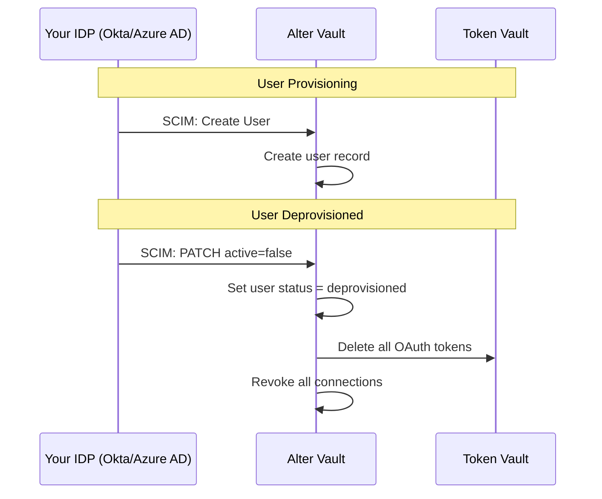

## What are External IDPs?

When your users authenticate through an identity provider like Okta, Azure AD, Auth0, or Clerk, Alter Vault can sync their identity for access control and lifecycle management.

This means when a user is **removed from your organization** in your IDP, their OAuth connections in Alter Vault are **immediately revoked** — no manual cleanup required.

<CardGroup cols={3}>
  <Card title="Automatic Deprovisioning" icon="shield-check">
    When users leave your org, their OAuth connections are immediately revoked and stored tokens deleted.
  </Card>
  <Card title="Group-Based Policies" icon="users">
    Control which groups can access which OAuth providers using your existing IDP groups.
  </Card>
  <Card title="Zero Configuration" icon="wand-magic-sparkles">
    Auto-detect IDP type and claim mappings from your OIDC issuer URL.
  </Card>
</CardGroup>

## How It Works

## Three Sync Strategies

Alter Vault supports multiple strategies for syncing user identity from your IDP:

| Strategy | When to Use | Latency | Setup |
|---|---|---|---|
| **SCIM 2.0** | Enterprise IDPs (Okta, Azure AD) | Real-time push | Enable in Developer Portal, configure IDP |
| **Lazy JWT Sync** | All OIDC IDPs | On token request | Automatic (zero config) |
| **Webhooks** | Modern IDPs (Clerk, Auth0, Okta) | Near real-time | Enable in Developer Portal, configure IDP |

### SCIM 2.0 (Recommended for Enterprise)

Your IDP pushes user and group changes to Alter Vault in real time. Best for organizations that need immediate deprovisioning when employees leave.

[Set up SCIM provisioning →](/identity-providers/scim)

### Lazy JWT Sync

When your application passes a JWT to Alter Vault during a token request, Alter Vault automatically extracts user identity and group memberships from the JWT claims. No additional configuration required beyond adding your IDP.

[Get started with IDP setup →](/identity-providers/quickstart)

### Webhooks

For IDPs that support webhook events (Clerk, Auth0, Okta), Alter Vault listens for user lifecycle events like `user.deleted` and triggers deprovisioning automatically. Enable webhooks in the Developer Portal to generate a signing secret, then configure your IDP to send events to the provided webhook URL.

## Supported Identity Providers

Alter Vault auto-detects your IDP type from the issuer URL and configures claim mappings automatically.

<CardGroup cols={2}>
  <Card title="Okta" icon="building">
    Full SCIM + JWT support with automatic detection
  </Card>
  <Card title="Microsoft Entra ID" icon="microsoft">
    Full SCIM + JWT support with automatic detection
  </Card>
  <Card title="Auth0" icon="lock">
    JWT support with automatic detection
  </Card>
  <Card title="Clerk" icon="key">
    JWT support with automatic detection
  </Card>
</CardGroup>

[See all supported providers →](/identity-providers/supported-providers)

## Next Steps

<CardGroup cols={2}>
  <Card title="IDP Setup Guide" icon="book-open" href="/identity-providers/quickstart">
    Step-by-step guide to connecting your IDP
  </Card>
  <Card title="SCIM Reference" icon="server" href="/identity-providers/scim">
    Technical reference for SCIM 2.0 provisioning
  </Card>
</CardGroup>
