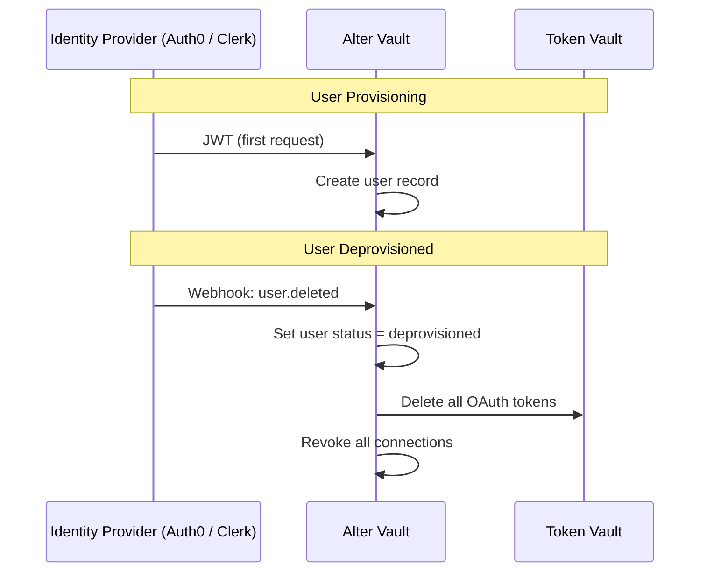
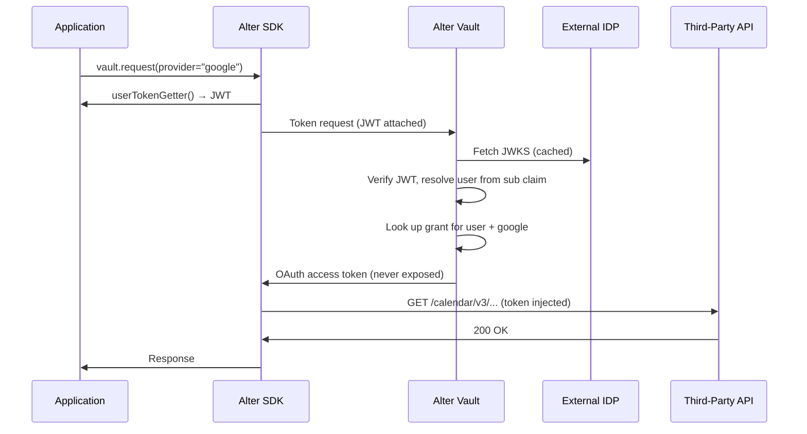

## What are Identity Providers?

When application users authenticate through Auth0 or Clerk, Alter Vault syncs their identity for access control and lifecycle management.

This means when a user is **removed from the organization** in the identity provider, their OAuth grants in Alter Vault are **immediately revoked** — no manual cleanup required.

<CardGroup cols={3}>
  <Card title="Automatic Deprovisioning" icon="shield-check">
    When users leave the organization, their OAuth grants are immediately revoked and stored tokens deleted.
  </Card>
  <Card title="Group-Based Policies" icon="users">
    Control which groups can access which OAuth providers using the groups defined in the identity provider.
  </Card>
  <Card title="Zero Configuration" icon="wand-magic-sparkles">
    Auto-detect IDP type and claim mappings from the OIDC issuer URL.
  </Card>
  <Card title="End-User Authentication" icon="key-round">
    Enable browser-based sign-in for SDK and Wallet dashboard via OIDC.
  </Card>
</CardGroup>

## How It Works



## Two Sync Strategies

Alter Vault supports two strategies for syncing user identity from the identity provider:

| Strategy | When to Use | Latency | Setup |
|---|---|---|---|
| **Webhooks** | Auth0 and Clerk | Near real-time | Enable in Developer Portal, configure IDP |
| **Lazy JWT Sync** | All OIDC IDPs | On token request | Automatic (zero config) |

<Info>
**Single-IDP rule:** only one identity provider can be active per application at a time. To switch providers, remove the current IDP and add the replacement. Replacing the provider updates the app-level identity contract.
</Info>

### Webhooks (Recommended)

Auth0 and Clerk push user lifecycle events to Alter Vault in real time. When a user is deleted or has their organization membership removed, Alter Vault immediately revokes their OAuth grants and deletes their stored tokens.

[Set up webhooks →](/identity-providers/quickstart)

### Lazy JWT Sync

When the application passes a JWT to Alter Vault during a token request, Alter Vault automatically extracts user identity and group memberships from the JWT claims. No additional configuration required beyond adding the identity provider.

[Get started with IDP setup →](/identity-providers/quickstart)

## How the IDP Connects to the SDK

Once an IDP is registered for an application, it connects to the SDK in two ways. Both can be used in the same app, but they are not independent on a single SDK instance: `vault.authenticate()` installs its token as the active token source and overrides any constructor-provided `user_token_getter` / `userTokenGetter` for subsequent `provider` requests.

### 1. Pass a user JWT for identity-based grant resolution

The application already signs users in through the IDP and holds a JWT. Pass that JWT to the SDK through `user_token_getter` (Python) / `userTokenGetter` (TypeScript), then call `vault.request(..., provider="google")`. The backend validates the JWT against the IDP's JWKS, resolves the `sub` claim to a user, and returns the grant that belongs to them — no `grant_id` bookkeeping required.

<CodeGroup>
```python Python
vault = AlterVault(
    api_key="alter_key_...",
    caller="my-agent",
    user_token_getter=lambda: get_current_user_jwt(),
)

response = await vault.request(
    HttpMethod.GET,
    "https://www.googleapis.com/calendar/v3/calendars/primary/events",
    provider="google",
)
```

```typescript TypeScript
const vault = new AlterVault({
  apiKey: "alter_key_...",
  caller: "my-agent",
  userTokenGetter: () => getCurrentUserJwt(),
});

const response = await vault.request(
  HttpMethod.GET,
  "https://www.googleapis.com/calendar/v3/calendars/primary/events",
  { provider: "google" },
);
```
</CodeGroup>

The first time a new user's JWT reaches Alter Vault, a user record and group memberships are created automatically from the claims (lazy JWT sync). Subsequent requests update the profile.

### 2. Let the SDK drive the login (`vault.authenticate()`)

If the application does not already hold a JWT — for example, a local CLI, an MCP server, or any process without a browser session — call `vault.authenticate()`. The SDK opens a browser-based OIDC flow through the IDP, handles the callback, and caches the resulting token. Subsequent `vault.request(..., provider=...)` calls reuse that token automatically. If `user_token_getter` / `userTokenGetter` was set in the constructor, `authenticate()` takes precedence on that SDK instance.

<CodeGroup>
```python Python
auth_result = await vault.authenticate()
print(auth_result.user_info)  # { sub, email, name, ... }
```

```typescript TypeScript
const authResult = await vault.authenticate();
console.log(authResult.userInfo); // { sub, email, name, ... }
```
</CodeGroup>

Enabling this flow requires one-time setup: register the SDK callback URL (shown in the Developer Portal) with the IDP and save the OAuth client ID and secret on the application's Identity page. The same credentials power the Wallet dashboard sign-in.

### What happens under the hood



See the [IDP Setup Guide](/identity-providers/quickstart) for step-by-step instructions on registering the IDP and configuring OIDC client credentials.

## Supported Identity Providers

Alter Vault auto-detects the IDP type from the issuer URL and configures claim mappings automatically.

<CardGroup cols={2}>
  <Card title="Auth0" icon="lock">
    JWT validation and Log Streams webhook support
  </Card>
  <Card title="Clerk" icon="key">
    JWT validation and Svix-signed webhook support
  </Card>
</CardGroup>

<Info>
**Enterprise SSO** (Okta, Entra ID, SAML): Both Auth0 and Clerk support upstream enterprise identity providers as first-class connections. Route enterprise customers through Auth0 or Clerk to take advantage of Alter Vault's lifecycle sync without direct Okta/Entra integration.
</Info>

[See all supported providers →](/identity-providers/supported-providers)

## Next Steps

<CardGroup cols={2}>
  <Card title="IDP Setup Guide" icon="book-open" href="/identity-providers/quickstart">
    Step-by-step guide to connecting Auth0 or Clerk
  </Card>
  <Card title="Supported Providers" icon="list" href="/identity-providers/supported-providers">
    Provider capabilities and claim conventions
  </Card>
</CardGroup>
