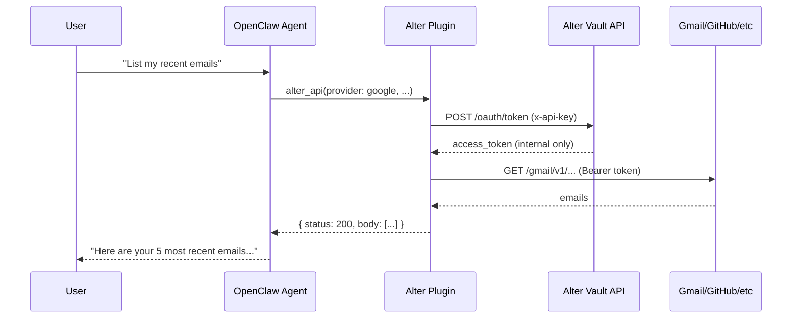

## Overview

The **Alter Vault OpenClaw plugin** lets your [OpenClaw](https://openclaw.dev) AI agent make authenticated API calls to external services (Gmail, GitHub, Slack, Microsoft, and more) without ever exposing OAuth tokens to the LLM.

Alter Vault handles all token management, refresh, and security. The agent simply says _"list my recent emails"_ and the plugin takes care of the rest.



<Note>
  **Zero Token Exposure**: The access token is retrieved internally and never returned to the LLM. The agent only sees the API response body.
</Note>

## What You Get

The plugin registers three tools that the OpenClaw agent can use:

<CardGroup cols={3}>
  <Card title="alter_api" icon="bolt">
    Make authenticated API calls to any connected service. Tokens injected automatically.
  </Card>
  <Card title="alter_connections" icon="link">
    List which services are connected and available for the agent to use.
  </Card>
  <Card title="alter_connect" icon="plus">
    Generate an OAuth link so the user can connect a new service mid-conversation.
  </Card>
</CardGroup>

## Prerequisites

Before setting up the plugin, you need:

1. An Alter Vault account with an application configured ([portal.alter.com](https://portal.alter.com))
2. At least one OAuth provider set up (Google, GitHub, Slack, etc.)
3. An OpenClaw installation ([openclaw.dev](https://openclaw.dev))

## Installation

<Steps>
  <Step title="Install the plugin">
    ```bash
    openclaw plugins install @alter-ai/openclaw-plugin
    ```

    This downloads the package, registers it as an extension, and enables it in your config.
  </Step>

  <Step title="Configure your Alter credentials">
    Set the plugin config in your OpenClaw config file (`~/.openclaw/openclaw.json`):

    ```json openclaw.json
    {
      "plugins": {
        "entries": {
          "alter-vault": {
            "enabled": true,
            "config": {
              "apiKey": "alter_key_...",
              "appId": "your-app-uuid",
              "attributes": {
                "user_id": "user_123"
              }
            }
          }
        }
      }
    }
    ```

    Or set individual values via the CLI:

    ```bash
    openclaw config set plugins.entries.alter-vault.config.apiKey "alter_key_..."
    openclaw config set plugins.entries.alter-vault.config.appId "your-app-uuid"
    ```

    Get your API key and app ID from the [Developer Portal](https://portal.alter.com).
  </Step>

  <Step title="Connect a service">
    If the user hasn't connected any services yet, the agent can generate an OAuth link:

    ```
    You: "Connect my Google account"
    Agent: Here's a link to connect your Google account: https://connect.alter.com/session/...
           Please open this in your browser to authorize access.
    ```

    Or connect through the [Alter Connect UI](/sdks/javascript/quickstart) in your app.
  </Step>

  <Step title="Start using it">
    ```
    You: "What services do I have connected?"
    Agent: You have the following connections:
           - Google (alice@gmail.com) - active
           - GitHub (alice) - active

    You: "List my 5 most recent emails"
    Agent: Here are your recent emails:
           1. "Q1 Planning" from bob@company.com - Jan 15
           2. ...
    ```
  </Step>
</Steps>

## Configuration Reference

| Parameter | Required | Description |
|-----------|----------|-------------|
| `apiKey` | Yes | Your Alter Vault API key (starts with `alter_key_`) |
| `appId` | Yes | Your application ID from the Developer Portal |
| `baseUrl` | No | Alter API base URL (default: `https://api.alter.com`) |
| `endUserId` | No | Identifier for the end user. Falls back to `attributes.user_id` |
| `attributes` | No | User attributes for matching OAuth connections (default: `{}`) |
| `timeout` | No | Request timeout in milliseconds (default: `30000`) |

### Attribution (User Matching)

The `attributes` field determines which OAuth connection to use. It must match the attributes used when the connection was created via Alter Connect.

```json
// Single user
{ "user_id": "alice" }

// Multi-tenant SaaS
{ "user_id": "alice", "org_id": "acme-corp" }

// Team shared connection
{ "team_id": "engineering" }
```

<Warning>
  Attributes must be consistent. If you connected Google with `user_id: "alice"`, you must use the same attribute to retrieve tokens. Changing attributes after connections are made will result in `ConnectionNotFoundError`.
</Warning>

## Tool Reference

### alter_connections

List connected services. The agent uses this to discover what's available before making API calls.

| Parameter | Type | Description |
|-----------|------|-------------|
| `provider` | string (optional) | Filter by provider (e.g. `"google"`, `"github"`) |

**Example agent interaction:**

```
Agent calls: alter_connections()
Response:
  - google: alice@gmail.com (active) - scopes: email, calendar, gmail
  - github: alice (active) - scopes: repo, user
```

### alter_api

Make an authenticated API call. This is the primary tool the agent uses to interact with external services.

| Parameter | Type | Description |
|-----------|------|-------------|
| `provider` | string | Provider ID: `"google"`, `"github"`, `"slack"`, `"microsoft"`, `"sentry"` |
| `method` | string | HTTP method: `GET`, `POST`, `PUT`, `PATCH`, `DELETE` |
| `url` | string | Full API URL (e.g. `https://www.googleapis.com/gmail/v1/users/me/messages`) |
| `headers` | string (optional) | Additional headers as JSON |
| `body` | string (optional) | Request body as JSON string |
| `query_params` | string (optional) | Query parameters as JSON |
| `reason` | string (optional) | Brief reason for the API call (for audit logging) |

**Example agent interaction:**

```
User: "List my recent emails"

Agent calls: alter_api(
  provider: "google",
  method: "GET",
  url: "https://www.googleapis.com/gmail/v1/users/me/messages",
  query_params: '{"maxResults": "5"}',
  reason: "User requested recent emails"
)

Response: { status: 200, body: { messages: [...] } }
```

### alter_connect

Generate an OAuth authorization link for the user to connect a new service.

| Parameter | Type | Description |
|-----------|------|-------------|
| `providers` | string (optional) | Comma-separated provider IDs to filter (e.g. `"google,github"`) |
| `return_url` | string (optional) | URL to redirect to after authorization |

**Example agent interaction:**

```
User: "I need to connect my Slack"

Agent calls: alter_connect(providers: "slack")
Response: { connect_url: "https://connect.alter.com/session/abc123", expires_in: 1800 }

Agent: Here's a link to connect your Slack account:
       https://connect.alter.com/session/abc123
       This link expires in 30 minutes.
```

## Common API Recipes

<AccordionGroup>
  <Accordion title="Gmail - List recent messages" icon="envelope">
    ```
    alter_api(
      provider: "google",
      method: "GET",
      url: "https://www.googleapis.com/gmail/v1/users/me/messages",
      query_params: '{"maxResults": "10"}'
    )
    ```
  </Accordion>

  <Accordion title="Gmail - Send an email" icon="paper-plane">
    ```
    alter_api(
      provider: "google",
      method: "POST",
      url: "https://www.googleapis.com/gmail/v1/users/me/messages/send",
      body: '{"raw": "<base64-encoded-email>"}'
    )
    ```
  </Accordion>

  <Accordion title="Google Calendar - List events" icon="calendar">
    ```
    alter_api(
      provider: "google",
      method: "GET",
      url: "https://www.googleapis.com/calendar/v3/calendars/primary/events",
      query_params: '{"maxResults": "10", "singleEvents": "true", "orderBy": "startTime"}'
    )
    ```
  </Accordion>

  <Accordion title="GitHub - List repositories" icon="code-branch">
    ```
    alter_api(
      provider: "github",
      method: "GET",
      url: "https://api.github.com/user/repos",
      query_params: '{"sort": "updated", "per_page": "10"}'
    )
    ```
  </Accordion>

  <Accordion title="GitHub - Create an issue" icon="circle-exclamation">
    ```
    alter_api(
      provider: "github",
      method: "POST",
      url: "https://api.github.com/repos/OWNER/REPO/issues",
      body: '{"title": "Bug report", "body": "Description here", "labels": ["bug"]}'
    )
    ```
  </Accordion>

  <Accordion title="Slack - Send a message" icon="hashtag">
    ```
    alter_api(
      provider: "slack",
      method: "POST",
      url: "https://slack.com/api/chat.postMessage",
      body: '{"channel": "#general", "text": "Hello from my AI agent!"}'
    )
    ```
  </Accordion>

  <Accordion title="Slack - List channels" icon="list">
    ```
    alter_api(
      provider: "slack",
      method: "GET",
      url: "https://slack.com/api/conversations.list",
      query_params: '{"types": "public_channel", "limit": "20"}'
    )
    ```
  </Accordion>

  <Accordion title="Microsoft - List emails" icon="microsoft">
    ```
    alter_api(
      provider: "microsoft",
      method: "GET",
      url: "https://graph.microsoft.com/v1.0/me/messages",
      query_params: '{"$top": "10", "$orderby": "receivedDateTime desc"}'
    )
    ```
  </Accordion>
</AccordionGroup>

## Security Architecture

The plugin uses the same **dual-client security pattern** as the [Alter Python SDK](/sdks/python/quickstart):

| Concern | How It's Handled |
|---------|-----------------|
| **Token exposure to LLM** | Tokens are retrieved internally and never returned to the agent. Only the API response body is visible. |
| **API key leakage** | Two separate HTTP clients: one for Alter backend (with `x-api-key`), one for external APIs (no `x-api-key`). The API key is never sent to third-party services. |
| **Header injection** | The `Authorization: Bearer` header is always set last, so LLM-provided headers cannot override it. |
| **Policy enforcement** | Every token retrieval is checked against your Cerbos policies (scopes, time-based access, IP allowlist, required attributes). |
| **Audit logging** | All API calls are logged with the `reason` field for compliance. |
| **Tenant isolation** | Connections are scoped to your app ID. One app cannot access another app's connections. |

## Error Handling

The plugin surfaces clear error messages to the agent:

| Error | Cause | What the Agent Sees |
|-------|-------|-------------------|
| `ConnectionNotFoundError` | User hasn't connected the provider | "No connection found for google. Use alter_connect to set one up." |
| `PolicyViolationError` | Access denied by policy rules | "Access denied: [policy reason]" |
| `TokenExpiredError` | Refresh token expired | "Token expired. User needs to reconnect via alter_connect." |
| `NetworkError` | Alter backend unreachable | "Could not reach Alter Vault. Please try again." |

## Troubleshooting

<AccordionGroup>
  <Accordion title="Agent says 'No connections found'" icon="circle-question">
    The user hasn't connected any services yet. Have the agent call `alter_connect` to generate an OAuth link, or set up connections through the [Alter Connect UI](/sdks/javascript/quickstart) in your app.
  </Accordion>

  <Accordion title="Agent gets 'Connection not found' for a specific provider" icon="circle-question">
    Check that the `attributes` in your plugin config match the attributes used when the connection was created. The most common issue is a mismatched `user_id`.
  </Accordion>

  <Accordion title="Agent gets 'Policy violation'" icon="shield">
    Your Cerbos policies are blocking the request. Check the policy configuration in the [Developer Portal](https://portal.alter.com) under **App Details → Policies**. Common causes are scope restrictions, time-based access rules, IP allowlist, or missing required connection attributes.
  </Accordion>

  <Accordion title="Plugin not loading in OpenClaw" icon="plug">
    1. Verify the plugin is installed: `openclaw plugins list`
    2. Check your `~/.openclaw/openclaw.json` for syntax errors
    3. Ensure `apiKey` starts with `alter_key_` and `appId` is a valid UUID
    4. Check the plugin entry has the right structure: `plugins.entries.alter-vault.config.apiKey`
  </Accordion>
</AccordionGroup>

## What's Next?

<CardGroup cols={2}>
  <Card
    title="Python SDK"
    icon="python"
    href="/sdks/python/quickstart"
  >
    Use Alter Vault from your own backend code
  </Card>
  <Card
    title="Alter Connect"
    icon="window"
    href="/sdks/javascript/quickstart"
  >
    Add OAuth connection UI to your app
  </Card>
  <Card
    title="Architecture"
    icon="building"
    href="/reference/architecture"
  >
    Understand the security model in depth
  </Card>
  <Card
    title="Developer Portal"
    icon="browser"
    href="/reference/developer-portal"
  >
    Configure providers and policies
  </Card>
</CardGroup>
