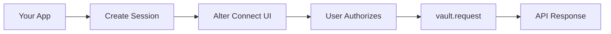

## Overview

This guide will help you integrate Alter Vault into your application. By the end, you'll be able to:
- Connect your users' OAuth accounts using Alter Connect
- Use the Python SDK to make API calls with automatic token injection
- Never handle OAuth tokens directly

## Architecture



### Key Components

1. **Python SDK (`alter-sdk`)** - Backend SDK that makes authenticated API calls via `vault.request()`
2. **Connect SDK (`@alter-ai/connect`)** - Frontend JavaScript SDK for OAuth flow UI
3. **Alter API** - Backend API at `https://api.alter.com`

## Prerequisites

Before you begin, you'll need:
- An Alter Vault account ([sign up free](https://portal.alter.com))
- An OAuth app with your provider (Google, Microsoft, etc.)
- Python 3.11+ or Node.js 16+

## Step 1: Create Your Application

<Steps>
  <Step title="Sign in to the Developer Portal">
    Go to [portal.alter.com](https://portal.alter.com) and sign in
  </Step>

  <Step title="Create an Application">
    Click "New Application" and give it a name
  </Step>

  <Step title="Get Your Credentials">
    Copy your API Key (starts with `alter_key_`) - you'll need this soon
  </Step>

  <Step title="Set Up Attribution">
    Configure how you'll identify users (single user, multi-tenant, or team-based)
  </Step>
</Steps>

## Step 2: Configure Your OAuth Provider

Let's set up Google as an example (other providers work similarly):

<Steps>
  <Step title="Go to Google Cloud Console">
    Navigate to [console.cloud.google.com](https://console.cloud.google.com)
  </Step>

  <Step title="Create OAuth Credentials">
    1. Go to "APIs & Services" → "Credentials"
    2. Click "Create Credentials" → "OAuth client ID"
    3. Choose "Web application"
    4. Add this redirect URI: `https://api.alter.com/oauth/callback`
  </Step>

  <Step title="Add to Alter Vault">
    In the Alter Vault dashboard:
    1. Go to "OAuth Providers" → "Add Provider"
    2. Select "Google"
    3. Enter your Client ID and Client Secret
    4. Save
  </Step>
</Steps>

## Step 3: Install the SDKs

<CodeGroup>

```bash Python Backend
pip install alter-sdk
```

```bash JavaScript Frontend
npm install @alter-ai/connect
```

</CodeGroup>

## Step 4: Create Session Endpoint

Your backend needs to create session tokens for the OAuth flow:

<CodeGroup>

```python Flask
import requests
from flask import Flask, request, jsonify

app = Flask(__name__)

ALTER_API_KEY = "alter_key_..."

@app.route('/api/oauth/session', methods=['POST'])
def create_oauth_session():
    user = request.user  # Your auth

    # Create session for Alter Connect
    response = requests.post(
        "https://api.alter.com/oauth/connect/session",
        headers={"x-api-key": ALTER_API_KEY},
        json={
            "end_user": {
                "id": str(user.id),
                "email": user.email
            },
            "attributes": {
                "user_id": str(user.id),
                "org_id": user.organization_id  # For multi-tenant apps
            },
            "allowed_providers": ["google", "slack", "microsoft"]
            # Note: allowed_origin is optional. If omitted, uses app.website_url
            # from Developer Portal. Wildcard '*' is NOT supported.
        }
    )

    return jsonify(response.json())
```

```javascript Express
const express = require('express');
const axios = require('axios');

const app = express();

const ALTER_API_KEY = 'alter_key_...';

app.post('/api/oauth/session', async (req, res) => {
    const user = req.user; // Your auth

    // Create session for Alter Connect
    const response = await axios.post(
        'https://api.alter.com/oauth/connect/session',
        {
            end_user: {
                id: user.id.toString(),
                email: user.email
            },
            attributes: {
                user_id: user.id.toString(),
                org_id: user.organizationId  // For multi-tenant apps
            },
            allowed_providers: ['google', 'slack', 'microsoft']
            // Note: allowed_origin is optional. If omitted, uses app.website_url
            // from Developer Portal. Wildcard '*' is NOT supported.
        },
        {
            headers: { 'x-api-key': ALTER_API_KEY }
        }
    );

    res.json(response.data);
});
```

</CodeGroup>

## Step 5: Add OAuth UI (Frontend)

Use Alter Connect to handle the OAuth flow:

<CodeGroup>

```javascript React
import AlterConnect from '@alter-ai/connect';

function IntegrationsPage() {
    const alterConnect = AlterConnect.create({
        customization: {
            colors: { primary: '#6366f1' }
        }
    });

    const handleConnect = async (provider) => {
        // Get session from YOUR backend
        const { session_token } = await fetch('/api/oauth/session', {
            method: 'POST',
            headers: { 'Authorization': `Bearer ${authToken}` }
        }).then(r => r.json());

        // Open Alter Connect UI
        await alterConnect.open({
            token: session_token,
            provider: provider, // Optional: pre-select provider
            onSuccess: (connection) => {
                console.log('Connected!', connection);
                // Refresh your integrations list
                loadIntegrations();
            },
            onError: (error) => {
                console.error('Connection failed', error);
            }
        });
    };

    return (
        <div>
            <button onClick={() => handleConnect('google')}>
                Connect Google
            </button>
            <button onClick={() => handleConnect('slack')}>
                Connect Slack
            </button>
        </div>
    );
}
```

```html HTML
<script src="https://cdn.jsdelivr.net/npm/@alter-ai/connect@latest/dist/alter-connect.umd.js"></script>

<button onclick="connectProvider('google')">Connect Google</button>
<button onclick="connectProvider('slack')">Connect Slack</button>

<script>
const alterConnect = AlterConnect.create();

async function connectProvider(provider) {
    // Get session from YOUR backend
    const response = await fetch('/api/oauth/session', {
        method: 'POST',
        headers: { 'Authorization': `Bearer ${authToken}` }
    });
    const { session_token } = await response.json();

    // Open Alter Connect UI
    await alterConnect.open({
        token: session_token,
        provider: provider,
        onSuccess: function(connection) {
            console.log('Connected!', connection);
            location.reload();
        },
        onError: function(error) {
            alert('Connection failed: ' + error.message);
        }
    });
}
</script>
```

</CodeGroup>

## Step 6: Use the Python SDK

Now use the SDK to make API calls with automatic token injection:

### Basic Usage

```python
import asyncio
from alter_sdk import AlterVault, Provider, HttpMethod

async def fetch_calendar_events(user_id: str):
    vault = AlterVault(api_key="alter_key_...")

    try:
        # Make API request - token is injected automatically!
        response = await vault.request(
            Provider.GOOGLE,
            HttpMethod.GET,
            "https://www.googleapis.com/calendar/v3/calendars/primary/events",
            user={"user_id": user_id},
            query_params={
                "maxResults": "10",
                "singleEvents": "true",
                "orderBy": "startTime",
            },
            reason="Fetching calendar events",
        )

        events = response.json()
        for event in events.get("items", []):
            start = event["start"].get("dateTime", event["start"].get("date"))
            print(f"{start}: {event.get('summary', 'No title')}")

        return events

    finally:
        await vault.close()

asyncio.run(fetch_calendar_events("user_123"))
```

### Using Context Managers

```python
async with AlterVault(api_key="alter_key_...") as vault:
    response = await vault.request(
        Provider.GOOGLE,
        HttpMethod.GET,
        "https://www.googleapis.com/calendar/v3/calendars/primary/events",
        user={"user_id": "alice"},
    )
    events = response.json()
# Clients automatically closed
```

### POST Requests and URL Templating

```python
async with AlterVault(api_key="alter_key_...") as vault:
    # POST with JSON body
    response = await vault.request(
        Provider.SLACK,
        HttpMethod.POST,
        "https://slack.com/api/chat.postMessage",
        user={"user_id": "alice"},
        json={"channel": "#general", "text": "Hello from Alter!"},
    )

    # URL path templating with automatic URL encoding
    response = await vault.request(
        Provider.SALESFORCE,
        HttpMethod.GET,
        "https://api.example.com/v1/accounts/{account_id}/contacts",
        user={"user_id": "alice"},
        path_params={"account_id": "acc-123"},
        query_params={"limit": "50"},
    )
```

### Error Handling

```python
from alter_sdk.exceptions import (
    PolicyViolationError,
    ConnectionNotFoundError,
    TokenExpiredError,
    NetworkError,
    ProviderAPIError,
)

try:
    response = await vault.request(
        Provider.GOOGLE, HttpMethod.GET,
        "https://www.googleapis.com/calendar/v3/calendars/primary/events",
        user={"user_id": "alice"},
    )
except PolicyViolationError as e:
    print(f"Access denied by policy: {e.message}")
except ConnectionNotFoundError:
    print("User hasn't connected Google yet - redirect to Alter Connect")
except TokenExpiredError:
    print("Token refresh failed - user needs to re-authenticate")
except NetworkError as e:
    print(f"Network issue: {e.message}")
except ProviderAPIError as e:
    print(f"Google API error {e.status_code}: {e.response_body}")
```

### AI Agent Integration

If you're building AI agents, add actor tracking for full observability:

```python
vault = AlterVault(
    api_key="alter_key_...",
    actor_type="ai_agent",
    actor_identifier="email-assistant-v2",
    actor_name="Email Assistant",
    actor_version="2.0.0",
    framework="langgraph",
)

# Actor identity is sent automatically on every request
# Per-request tracking adds execution context
response = await vault.request(
    Provider.GOOGLE,
    HttpMethod.GET,
    "https://gmail.googleapis.com/gmail/v1/users/me/messages",
    user={"user_id": "alice"},
    run_id="run-001",
    thread_id="thread-daily-digest",
    tool_call_id="call_read_emails",
    reason="Reading emails for daily digest",
)
```

See the [Python SDK Quickstart](/sdks/python/quickstart#actor-tracking-ai-agents--mcp-servers) for the complete actor tracking guide.

## Complete Example: Flask + Google Calendar

Here's a full example showing a Flask API that fetches calendar events:

```python
import asyncio
from flask import Flask, jsonify
from alter_sdk import AlterVault, Provider, HttpMethod
from alter_sdk.exceptions import ConnectionNotFoundError

app = Flask(__name__)
vault = AlterVault(api_key="alter_key_...")

@app.route('/api/users/<user_id>/events')
def get_user_events(user_id):
    """Fetch user's calendar events using Alter SDK."""

    async def fetch_events():
        try:
            response = await vault.request(
                Provider.GOOGLE,
                HttpMethod.GET,
                "https://www.googleapis.com/calendar/v3/calendars/primary/events",
                user={"user_id": user_id},
                query_params={
                    "maxResults": "10",
                    "singleEvents": "true",
                    "orderBy": "startTime",
                },
                reason="User viewing calendar events",
            )
            return response.json()
        except ConnectionNotFoundError:
            return None

    result = asyncio.run(fetch_events())

    if result is None:
        return jsonify({"error": "User hasn't connected Google account"}), 404

    return jsonify(result)

if __name__ == '__main__':
    app.run(debug=True)
```

## Key Concepts

### Zero Token Exposure
The Alter SDK **never exposes OAuth tokens** to your code:
- Tokens are retrieved internally by the SDK
- Automatically injected into API calls as Bearer headers
- Refreshed transparently when needed
- You only work with API results, not credentials

### Attribution
How you identify which OAuth connection to use:

```python
# Single user
user={"user_id": "alice"}

# Multi-tenant SaaS
user={"org_id": "acme", "user_id": "alice"}

# Team shared connection
user={"team_id": "engineering"}
```

### Provider Support
The SDK works with **any** OAuth provider through a single method:

```python
# Use Provider enums for supported providers
await vault.request(Provider.GOOGLE, HttpMethod.GET, url, user=user)
await vault.request(Provider.GITHUB, HttpMethod.GET, url, user=user)
await vault.request(Provider.SLACK, HttpMethod.POST, url, user=user)

# Use strings for any provider
await vault.request("notion", HttpMethod.GET, url, user=user)
await vault.request("hubspot", HttpMethod.POST, url, user=user)
```

## Best Practices

### Security
- Keep API keys server-side only
- Use session tokens (short-lived) for frontend
- Set IP restrictions in production

### Attribution
- Use consistent user identifiers
- Include organizational context for multi-tenant apps
- Don't change attribution after connections are made

### Error Handling
- Always handle `PolicyViolationError` and `ConnectionNotFoundError` explicitly
- Don't catch all exceptions with a bare `except Exception`
- Use retry logic for `NetworkError` (with exponential backoff)

## Troubleshooting

### Connection Not Found
If you get `ConnectionNotFoundError`, ensure:
- User has completed OAuth flow via Alter Connect
- Attribution matches exactly (same keys and values)
- Connection hasn't been revoked

### Token Expired
The SDK automatically refreshes tokens. If refresh fails:
- User may need to re-authenticate
- Check if refresh token has expired
- Verify OAuth app credentials are still valid

### Policy Violation
If you get `PolicyViolationError`:
- Check the error message for the specific rule that failed (scopes, time, IP, or attributes)
- Review the policy configuration in **App Details → Policies** in the Developer Portal
- Verify the connection's scopes match the policy's `allowed_scopes`
- If using IP allowlist, confirm your server's IP is included
- If using time restrictions, check if you're within business hours / weekdays

### Provider Not Configured
If you get `TokenRetrievalError` with "not configured":
- Add the provider in the Alter Vault dashboard
- Enter your OAuth Client ID and Client Secret

## What's Next?

<CardGroup cols={2}>
  <Card
    title="Python SDK"
    icon="python"
    href="/sdks/python/quickstart"
  >
    Deep dive into the Python SDK with actor tracking
  </Card>
  <Card
    title="Alter Connect"
    icon="window"
    href="/sdks/javascript/quickstart"
  >
    Customize the OAuth UI
  </Card>
  <Card
    title="Architecture"
    icon="building"
    href="/reference/architecture"
  >
    Understand the security architecture
  </Card>
  <Card
    title="Audit Logs"
    icon="clipboard-list"
    href="/reference/audit-logs"
  >
    Compliance and observability
  </Card>
  <Card
    title="OpenClaw Plugin"
    icon="robot"
    href="/integrations/openclaw"
  >
    AI agent OAuth integration
  </Card>
  <Card
    title="Portal Guide"
    icon="browser"
    href="/reference/developer-portal"
  >
    Configure providers and policies
  </Card>
</CardGroup>

## Need Help?

- Email: [support@alter.com](mailto:support@alter.com)
- Documentation: [docs.alter.com](https://docs.alter.com)
- Community: [Join our Community](mailto:support@alter.com)
