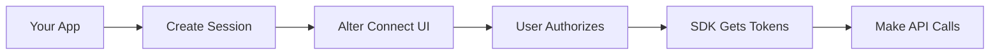

## Overview

This guide will help you integrate Alter Vault into your application. By the end, you'll be able to:
- Connect your users' OAuth accounts using Alter Connect
- Use the Python SDK to make API calls with automatic token injection
- Never handle OAuth tokens directly

## Architecture



### Key Components

1. **Python SDK (`alter-sdk`)** - Backend SDK that handles token retrieval and API calls
2. **Connect SDK (`@alter-ai/connect`)** - Frontend JavaScript SDK for OAuth flow UI
3. **Alter API** - Backend API at `https://api.alter.com`

## Prerequisites

Before you begin, you'll need:
- An Alter Vault account ([sign up free](https://portal.alter.com))
- An OAuth app with your provider (Google, Microsoft, etc.)
- Python 3.11+ or Node.js 16+

## Step 1: Create Your Application

<Steps>
  <Step title="Sign in to the Developer Portal">
    Go to [portal.alter.com](https://portal.alter.com) and sign in
  </Step>

  <Step title="Create an Application">
    Click "New Application" and give it a name
  </Step>

  <Step title="Get Your Credentials">
    Copy your API Key (starts with `alter_key_`) and App ID - you'll need these soon
  </Step>

  <Step title="Set Up Attribution">
    Configure how you'll identify users (single user, multi-tenant, or team-based)
  </Step>
</Steps>

## Step 2: Configure Your OAuth Provider

Let's set up Google as an example (other providers work similarly):

<Steps>
  <Step title="Go to Google Cloud Console">
    Navigate to [console.cloud.google.com](https://console.cloud.google.com)
  </Step>

  <Step title="Create OAuth Credentials">
    1. Go to "APIs & Services" → "Credentials"
    2. Click "Create Credentials" → "OAuth client ID"
    3. Choose "Web application"
    4. Add this redirect URI: `https://api.alter.com/oauth/callback`
  </Step>

  <Step title="Add to Alter Vault">
    In the Alter Vault dashboard:
    1. Go to "OAuth Providers" → "Add Provider"
    2. Select "Google"
    3. Enter your Client ID and Client Secret
    4. Save
  </Step>
</Steps>

## Step 3: Install the SDKs

<CodeGroup>

```bash Python Backend (Core)
# Core SDK only
pip install alter-sdk

# With Google API support
pip install alter-sdk[google]

# With all provider support
pip install alter-sdk[all]
```

```bash JavaScript Frontend
# Install Connect SDK for OAuth UI
npm install @alter-ai/connect
```

</CodeGroup>

## Step 4: Create Session Endpoint

Your backend needs to create session tokens for the OAuth flow:

<CodeGroup>

```python Flask
import requests
from flask import Flask, request, jsonify

app = Flask(__name__)

ALTER_API_KEY = "alter_key_..."
ALTER_APP_ID = "app_..."

@app.route('/api/oauth/session', methods=['POST'])
def create_oauth_session():
    user = request.user  # Your auth

    # Create session for Alter Connect
    response = requests.post(
        "https://api.alter.com/oauth/connect/session",
        headers={"x-api-key": ALTER_API_KEY},
        json={
            "end_user": {
                "id": str(user.id),
                "email": user.email
            },
            "attributes": {
                "user_id": str(user.id),
                "org_id": user.organization_id  # For multi-tenant apps
            },
            "allowed_providers": ["google", "slack", "microsoft"]
        }
    )

    return jsonify(response.json())
```

```javascript Express
const express = require('express');
const axios = require('axios');

const app = express();

const ALTER_API_KEY = 'alter_key_...';
const ALTER_APP_ID = 'app_...';

app.post('/api/oauth/session', async (req, res) => {
    const user = req.user; // Your auth

    // Create session for Alter Connect
    const response = await axios.post(
        'https://api.alter.com/oauth/connect/session',
        {
            end_user: {
                id: user.id.toString(),
                email: user.email
            },
            attributes: {
                user_id: user.id.toString(),
                org_id: user.organizationId  // For multi-tenant apps
            },
            allowed_providers: ['google', 'slack', 'microsoft']
        },
        {
            headers: { 'x-api-key': ALTER_API_KEY }
        }
    );

    res.json(response.data);
});
```

</CodeGroup>

## Step 5: Add OAuth UI (Frontend)

Use Alter Connect to handle the OAuth flow:

<CodeGroup>

```javascript React
import AlterConnect from '@alter-ai/connect';

function IntegrationsPage() {
    const alterConnect = AlterConnect.create({
        customization: {
            colors: { primary: '#6366f1' }
        }
    });

    const handleConnect = async (provider) => {
        // Get session from YOUR backend
        const { session_token } = await fetch('/api/oauth/session', {
            method: 'POST',
            headers: { 'Authorization': `Bearer ${authToken}` }
        }).then(r => r.json());

        // Open Alter Connect UI
        await alterConnect.open({
            token: session_token,
            provider: provider, // Optional: pre-select provider
            onSuccess: (connection) => {
                console.log('Connected!', connection);
                // Refresh your integrations list
                loadIntegrations();
            },
            onError: (error) => {
                console.error('Connection failed', error);
            }
        });
    };

    return (
        <div>
            <button onClick={() => handleConnect('google')}>
                Connect Google
            </button>
            <button onClick={() => handleConnect('slack')}>
                Connect Slack
            </button>
        </div>
    );
}
```

```html HTML
<script src="https://cdn.jsdelivr.net/npm/@alter-ai/connect@latest/dist/alter-connect.umd.js"></script>

<button onclick="connectProvider('google')">Connect Google</button>
<button onclick="connectProvider('slack')">Connect Slack</button>

<script>
const alterConnect = AlterConnect.create();

async function connectProvider(provider) {
    // Get session from YOUR backend
    const response = await fetch('/api/oauth/session', {
        method: 'POST',
        headers: { 'Authorization': `Bearer ${authToken}` }
    });
    const { session_token } = await response.json();

    // Open Alter Connect UI
    await alterConnect.open({
        token: session_token,
        provider: provider,
        onSuccess: function(connection) {
            console.log('Connected!', connection);
            location.reload();
        },
        onError: function(error) {
            alert('Connection failed: ' + error.message);
        }
    });
}
</script>
```

</CodeGroup>

## Step 6: Use the Python SDK

Now use the SDK to make API calls with automatic token injection:

### Basic Usage

```python
import asyncio
from alter_sdk import AlterVault, Provider

async def fetch_google_calendar_events(user_id):
    # Initialize SDK
    vault = AlterVault(
        api_key="alter_key_...",
        app_id="app_..."
    )

    try:
        # Get Google client - tokens are injected automatically!
        google = await vault.get_client(
            provider=Provider.GOOGLE,
            user={"user_id": str(user_id)},
            reason="Fetching calendar events"
        )

        # Use Google APIs normally - no token handling!
        calendar = await google.build("calendar", "v3")

        events = calendar.events().list(
            calendarId='primary',
            maxResults=10,
            singleEvents=True,
            orderBy='startTime'
        ).execute()

        # Process events
        for event in events.get('items', []):
            start = event['start'].get('dateTime', event['start'].get('date'))
            print(f"{start}: {event.get('summary', 'No title')}")

        return events

    finally:
        await vault.close()

# Run the async function
asyncio.run(fetch_google_calendar_events("user_123"))
```

### Generic API Calls

For providers without dedicated wrappers, use `call_api()`:

```python
async def call_stripe_api(user_id):
    vault = AlterVault(
        api_key="alter_key_...",
        app_id="app_..."
    )

    # Make API call - token injected automatically!
    response = await vault.call_api(
        provider=Provider.STRIPE,
        method="GET",
        endpoint="https://api.stripe.com/v1/customers",
        user={"user_id": user_id},
        reason="Fetching customer list"
    )

    customers = response.json()
    print(f"Found {len(customers['data'])} customers")

    await vault.close()
```

## Complete Example: Gmail Integration

Here's a full example showing a Flask API that fetches Gmail messages:

```python
import asyncio
from flask import Flask, jsonify
from alter_sdk import AlterVault, Provider
from alter_sdk.exceptions import ConnectionNotFoundError

app = Flask(__name__)

# Initialize Alter SDK
vault = AlterVault(
    api_key="alter_key_...",
    app_id="app_..."
)

@app.route('/api/users/<user_id>/emails')
def get_user_emails(user_id):
    """Fetch user's Gmail messages using Alter SDK."""

    async def fetch_emails():
        try:
            # Get Google client with automatic token injection
            google = await vault.get_client(
                provider=Provider.GOOGLE,
                user={"user_id": user_id}
            )

            # Build Gmail service
            gmail = await google.build("gmail", "v1")

            # Fetch messages - tokens handled automatically!
            messages = gmail.users().messages().list(
                userId='me',
                maxResults=10
            ).execute()

            return messages

        except ConnectionNotFoundError:
            return None

    # Run async function
    loop = asyncio.new_event_loop()
    asyncio.set_event_loop(loop)
    result = loop.run_until_complete(fetch_emails())

    if result is None:
        return jsonify({"error": "User hasn't connected Google account"}), 404

    return jsonify(result)

@app.teardown_appcontext
def close_vault(error):
    """Clean up SDK on app teardown."""
    loop = asyncio.new_event_loop()
    loop.run_until_complete(vault.close())

if __name__ == '__main__':
    app.run(debug=True)
```

## More Examples

### Sync Google Calendar

```python
async def sync_calendar_events(user_id):
    vault = AlterVault(
        api_key="alter_key_...",
        app_id="app_..."
    )

    google = await vault.get_client(
        provider=Provider.GOOGLE,
        user={"user_id": user_id},
        reason="Syncing calendar events"
    )

    calendar = await google.build("calendar", "v3")

    events_result = calendar.events().list(
        calendarId="primary",
        timeMin=datetime.now().isoformat() + 'Z',
        maxResults=10,
        singleEvents=True,
        orderBy='startTime'
    ).execute()

    # Save to your database
    for event in events_result.get("items", []):
        save_event_to_db(user_id, event)

    await vault.close()
```

### Post to Slack

```python
async def post_slack_message(user_id, channel, text):
    vault = AlterVault(
        api_key="alter_key_...",
        app_id="app_..."
    )

    response = await vault.call_api(
        provider=Provider.SLACK,
        method="POST",
        endpoint="https://slack.com/api/chat.postMessage",
        user={"user_id": user_id},
        body={
            "channel": channel,
            "text": text
        },
        reason="Posting message to Slack"
    )

    await vault.close()
    return response.json()
```

### List GitHub Repos

```python
async def list_github_repos(user_id):
    vault = AlterVault(
        api_key="alter_key_...",
        app_id="app_..."
    )

    github = await vault.get_client(
        provider=Provider.GITHUB,
        user={"user_id": user_id}
    )

    # Use PyGithub API normally
    user = github.get_user()
    repos = user.get_repos()

    for repo in repos:
        print(f"Repo: {repo.name} - {repo.description}")

    await vault.close()
```

## Key Concepts

### Zero Token Exposure
The Alter SDK **never exposes OAuth tokens** to your code:
- Tokens are retrieved internally by the SDK
- Automatically injected into API calls
- Refreshed transparently when needed
- You only work with API results, not credentials

### Attribution
How you identify which OAuth connection to use:

```python
# Single user
user={"user_id": "alice"}

# Multi-tenant SaaS
user={"org_id": "acme", "user_id": "alice"}

# Team shared connection
user={"team_id": "engineering"}
```

### Provider Support
The SDK provides native wrappers for:
- **Google**: Calendar, Gmail, Drive, Sheets
- **GitHub**: Repos, Issues, PRs
- **Slack**: Channels, Messages
- **Generic**: Any OAuth provider via `call_api()`

## Best Practices

### Token Management
- Use the SDK's `get_client()` for automatic token handling
- Never cache tokens client-side
- Always use `async`/`await` with the Python SDK

### Attribution
- Use consistent user identifiers
- Include organizational context for multi-tenant apps
- Don't change attribution after connections are made

### Security
- Keep API keys server-side only
- Use session tokens (short-lived) for frontend
- Set IP restrictions in production

## Troubleshooting

### Connection Not Found
If you get `ConnectionNotFoundError`, ensure:
- User has completed OAuth flow
- Attribution matches exactly (same keys and values)
- Connection hasn't been revoked

### Token Expired
The SDK automatically refreshes tokens. If refresh fails:
- User may need to re-authenticate
- Check if refresh token has expired
- Verify OAuth app credentials are still valid

### Policy Violation
If you get `PolicyViolationError`:
- Check IP restrictions
- Verify rate limits
- Review scope requirements

## What's Next?

<CardGroup cols={2}>
  <Card
    title="Python SDK"
    icon="python"
    href="/sdks/python/quickstart"
  >
    Deep dive into the Python SDK
  </Card>
  <Card
    title="Alter Connect"
    icon="window"
    href="/sdks/javascript/quickstart"
  >
    Customize the OAuth UI
  </Card>
  <Card
    title="Architecture"
    icon="building"
    href="/reference/architecture"
  >
    Understand the security architecture
  </Card>
  <Card
    title="Portal Guide"
    icon="browser"
    href="/reference/developer-portal"
  >
    Configure providers and policies
  </Card>
</CardGroup>

## Need Help?

- Email: [support@alter.com](mailto:support@alter.com)
- Documentation: [docs.alter.com](https://docs.alter.com)
- Community: [Join our Community](mailto:support@alter.com)
