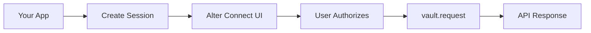

## Overview

This guide will help you integrate Alter Vault into your application. By the end, you'll be able to:
- Connect your users' OAuth accounts using Alter Connect
- Use the Python SDK to make API calls with automatic token injection
- Never handle OAuth tokens directly

## Architecture


```mermaid
graph LR
    A[Your App] --> B[Create Session]
    B --> C[Alter Connect UI]
    C --> D[User Authorizes]
    D --> E[vault.request]
    E --> F[API Response]
```

### Key Components

1. **Python SDK (`alter-sdk`)** - Backend SDK that makes authenticated API calls via `vault.request()`
2. **Connect SDK (`@alter-ai/connect`)** - Frontend JavaScript SDK for OAuth flow UI
3. **Alter API** - Handles OAuth and token management (no URL configuration needed — SDKs connect automatically)

## Prerequisites

Before you begin, you'll need:
- An Alter Vault account ([sign up free](https://portal.alterai.dev))
- An OAuth app with your provider (Google, GitHub, etc.)
- Python 3.11+ or Node.js 18+

## Step 1: Create Your Application

<Steps>
  <Step title="Sign in to the Developer Portal">
    Go to [portal.alterai.dev](https://portal.alterai.dev) and sign in
  </Step>

  <Step title="Create an Application">
    Click "New Application" and give it a name
  </Step>

  <Step title="Get Your Credentials">
    Copy your API Key (starts with `alter_key_`) - you'll need this soon
  </Step>

  <Step title="Configure OAuth Providers">
    Add your OAuth provider credentials (Google, Slack, GitHub, etc.)
  </Step>
</Steps>

## Step 2: Configure Your OAuth Provider

Let's set up Google as an example (other providers work similarly):

<Steps>
  <Step title="Go to Google Cloud Console">
    Navigate to [console.cloud.google.com](https://console.cloud.google.com)
  </Step>

  <Step title="Create OAuth Credentials">
    1. Go to "APIs & Services" → "Credentials"
    2. Click "Create Credentials" → "OAuth client ID"
    3. Choose "Web application"
    4. Add the **Redirect URI** from the [Developer Portal](https://portal.alterai.dev)
  </Step>

  <Step title="Add to Alter Vault">
    In the Alter Vault dashboard:
    1. Go to "OAuth Providers" → "Add Provider"
    2. Select "Google"
    3. Enter your Client ID and Client Secret
    4. Save
  </Step>
</Steps>

## Step 3: Install the SDKs

<CodeGroup>

```bash Python Backend
pip install alter-sdk
```

```bash JavaScript Frontend
npm install @alter-ai/connect
```

</CodeGroup>

## Step 4: Create Session Endpoint

Your backend needs to create session tokens for the OAuth flow. Use the SDK's `create_connect_session()` method:

<CodeGroup>

```python Flask (Python SDK)
import asyncio
from flask import Flask, request, jsonify
from alter_sdk import AlterVault, ActorType

app = Flask(__name__)

vault = AlterVault(
    api_key="alter_key_...",
    actor_type=ActorType.BACKEND_SERVICE,
    actor_identifier="my-flask-app",
)

@app.route('/api/oauth/session', methods=['POST'])
def create_oauth_session():
    user = request.user  # Your auth

    async def _create():
        session = await vault.create_connect_session(
            end_user={"id": str(user.id), "email": user.email},
            allowed_providers=["google", "slack", "github"],
            # allowed_origin is optional. If omitted, uses website_url
            # from Developer Portal. Wildcard '*' is NOT supported.
        )
        return session

    session = asyncio.run(_create())
    return jsonify({"session_token": session.session_token})
```

```javascript Express (TypeScript SDK)
const express = require('express');
const { AlterVault, ActorType } = require('@alter-ai/alter-sdk');

const app = express();

const vault = new AlterVault({
  apiKey: 'alter_key_...',
  actorType: ActorType.BACKEND_SERVICE,
  actorIdentifier: 'my-express-app',
});

app.post('/api/oauth/session', async (req, res) => {
    const user = req.user; // Your auth

    const session = await vault.createConnectSession({
        endUser: { id: user.id.toString(), email: user.email },
        allowedProviders: ['google', 'slack', 'github'],
        // allowedOrigin is optional. If omitted, uses website_url
        // from Developer Portal. Wildcard '*' is NOT supported.
    });

    res.json({ session_token: session.sessionToken });
});
```

</CodeGroup>

## Step 5: Add OAuth UI (Frontend)

Use Alter Connect to handle the OAuth flow:

<CodeGroup>

```javascript React
import AlterConnect from '@alter-ai/connect';

function IntegrationsPage() {
    const alterConnect = AlterConnect.create({
        customization: {
            colors: { primary: '#6366f1' }
        }
    });

    const handleConnect = async (provider) => {
        // Get session from YOUR backend
        const { session_token } = await fetch('/api/oauth/session', {
            method: 'POST',
            headers: { 'Authorization': `Bearer ${authToken}` }
        }).then(r => r.json());

        // Open Alter Connect UI
        await alterConnect.open({
            token: session_token,
            provider: provider, // Optional: pre-select provider
            onSuccess: (connection) => {
                console.log('Connected!', connection);
                // Refresh your integrations list
                loadIntegrations();
            },
            onError: (error) => {
                console.error('Connection failed', error);
            }
        });
    };

    return (
        <div>
            <button onClick={() => handleConnect('google')}>
                Connect Google
            </button>
            <button onClick={() => handleConnect('slack')}>
                Connect Slack
            </button>
        </div>
    );
}
```

```html HTML
<script src="https://cdn.jsdelivr.net/npm/@alter-ai/connect@latest/dist/alter-connect.umd.js"></script>

<button onclick="connectProvider('google')">Connect Google</button>
<button onclick="connectProvider('slack')">Connect Slack</button>

<script>
const alterConnect = AlterConnect.create();

async function connectProvider(provider) {
    // Get session from YOUR backend
    const response = await fetch('/api/oauth/session', {
        method: 'POST',
        headers: { 'Authorization': `Bearer ${authToken}` }
    });
    const { session_token } = await response.json();

    // Open Alter Connect UI
    await alterConnect.open({
        token: session_token,
        provider: provider,
        onSuccess: function(connection) {
            console.log('Connected!', connection);
            location.reload();
        },
        onError: function(error) {
            alert('Connection failed: ' + error.message);
        }
    });
}
</script>
```

</CodeGroup>

## Step 6: Use the Python SDK

Now use the SDK to make API calls with automatic token injection:

### Basic Usage

```python
import asyncio
from alter_sdk import AlterVault, ActorType, HttpMethod

async def fetch_calendar_events(user_id: str):
    vault = AlterVault(
        api_key="alter_key_...",
        actor_type=ActorType.AI_AGENT,
        actor_identifier="my-agent",
    )

    # Your app stores connection_id when the user completes Alter Connect (Step 5)
    connection_id = db.get_connection(user_id=user_id, provider="google")

    try:
        # Make API request — token is injected automatically
        response = await vault.request(
            connection_id,
            HttpMethod.GET,
            "https://www.googleapis.com/calendar/v3/calendars/primary/events",
            query_params={
                "maxResults": "10",
                "singleEvents": "true",
                "orderBy": "startTime",
            },
            reason="Fetching calendar events",
        )

        events = response.json()
        for event in events.get("items", []):
            start = event["start"].get("dateTime", event["start"].get("date"))
            print(f"{start}: {event.get('summary', 'No title')}")

        return events

    finally:
        await vault.close()

asyncio.run(fetch_calendar_events("alice"))
```

### Using Context Managers

```python
async with AlterVault(
    api_key="alter_key_...",
    actor_type=ActorType.AI_AGENT,
    actor_identifier="my-agent",
) as vault:
    response = await vault.request(
        "CONNECTION_ID",  # from Alter Connect
        HttpMethod.GET,
        "https://www.googleapis.com/calendar/v3/calendars/primary/events",
    )
    events = response.json()
# Clients automatically closed
```

### POST Requests and URL Templating

```python
async with AlterVault(
    api_key="alter_key_...",
    actor_type=ActorType.AI_AGENT,
    actor_identifier="my-agent",
) as vault:
    # POST with JSON body
    response = await vault.request(
        slack_connection_id,  # from Alter Connect
        HttpMethod.POST,
        "https://slack.com/api/chat.postMessage",
        json={"channel": "#general", "text": "Hello from Alter!"},
    )

    # URL path templating with automatic URL encoding
    response = await vault.request(
        sentry_connection_id,  # from Alter Connect
        HttpMethod.GET,
        "https://api.example.com/v1/accounts/{account_id}/contacts",
        path_params={"account_id": "acc-123"},
        query_params={"limit": "50"},
    )
```

### Error Handling

```python
from alter_sdk.exceptions import (
    PolicyViolationError,
    ConnectionNotFoundError,
    TokenExpiredError,
    NetworkError,
    ProviderAPIError,
)

try:
    response = await vault.request(
        connection_id, HttpMethod.GET,
        "https://www.googleapis.com/calendar/v3/calendars/primary/events",
    )
except PolicyViolationError as e:
    print(f"Access denied by policy: {e.message}")
except ConnectionNotFoundError:
    print("User hasn't connected Google yet - redirect to Alter Connect")
except TokenExpiredError:
    print("Token refresh failed - user needs to re-authenticate")
except NetworkError as e:
    print(f"Network issue: {e.message}")
except ProviderAPIError as e:
    print(f"Google API error {e.status_code}: {e.response_body}")
```

### AI Agent Integration

If you're building AI agents, add actor tracking for full observability:

```python
vault = AlterVault(
    api_key="alter_key_...",
    actor_type=ActorType.AI_AGENT,
    actor_identifier="email-assistant-v2",
    actor_name="Email Assistant",
    actor_version="2.0.0",
    framework="langgraph",
)

# Actor identity is sent automatically on every request
# Per-request tracking adds execution context
response = await vault.request(
    "CONNECTION_ID",  # from Alter Connect
    HttpMethod.GET,
    "https://gmail.googleapis.com/gmail/v1/users/me/messages",
    run_id="run-001",
    thread_id="thread-daily-digest",
    tool_call_id="call_read_emails",
    reason="Reading emails for daily digest",
)
```

See the [Python SDK Quickstart](/sdks/python/quickstart#actor-tracking-ai-agents--mcp-servers) for the complete actor tracking guide.

## Complete Example: Flask + Google Calendar

Here's a full example showing a Flask API that fetches calendar events:

```python
import asyncio
from flask import Flask, jsonify, request
from alter_sdk import AlterVault, ActorType, HttpMethod
from alter_sdk.exceptions import ConnectionNotFoundError

app = Flask(__name__)
vault = AlterVault(
    api_key="alter_key_...",
    actor_type=ActorType.BACKEND_SERVICE,
    actor_identifier="my-flask-app",
)

@app.route('/api/users/<user_id>/events')
def get_user_events(user_id):
    """Fetch user's calendar events using Alter SDK."""
    # Your app stores connection_id when the user completes Alter Connect (Step 5)
    connection_id = db.get_connection(user_id=user_id, provider="google")

    async def fetch_events():
        try:
            response = await vault.request(
                connection_id,
                HttpMethod.GET,
                "https://www.googleapis.com/calendar/v3/calendars/primary/events",
                query_params={
                    "maxResults": "10",
                    "singleEvents": "true",
                    "orderBy": "startTime",
                },
                reason="User viewing calendar events",
            )
            return response.json()
        except ConnectionNotFoundError:
            return None

    result = asyncio.run(fetch_events())

    if result is None:
        return jsonify({"error": "User hasn't connected Google account"}), 404

    return jsonify(result)

if __name__ == '__main__':
    app.run(debug=True)
```

## Alternative: Using Managed Secrets

If you're connecting to **your own APIs** (internal services, partner APIs, SaaS platforms with API keys), you don't need the OAuth flow. Use Managed Secrets instead.

### Step 1: Store Your Secret

1. Go to the Developer Portal → your app → **Managed Secrets**
2. Click **Add Provider** (e.g., "Loyalty API")
3. Choose credential type (Bearer Token, API Key, or Basic Auth)
4. Click **Store Secret** and enter the credential value
5. Copy the `connection_id` returned

### Step 2: Use vault.request()

Use the exact same `vault.request()` method — just pass the managed secret's `connection_id`:

<CodeGroup>

```python Python
from alter_sdk import AlterVault, ActorType, HttpMethod

async with AlterVault(
    api_key="alter_key_...",
    actor_type=ActorType.AI_AGENT,
    actor_identifier="my-agent",
) as vault:
    # Call your internal API — secret injected automatically
    response = await vault.request(
        "MANAGED_SECRET_CONNECTION_ID",  # from Developer Portal
        HttpMethod.GET,
        "https://api.internal.com/v1/loyalty/points",
        query_params={"user_id": "alice"},
        reason="Checking loyalty points",
    )
    points = response.json()
```

```typescript TypeScript
import { AlterVault, ActorType, HttpMethod } from "@alter-ai/alter-sdk";

const vault = new AlterVault({
  apiKey: "alter_key_...",
  actorType: ActorType.AI_AGENT,
  actorIdentifier: "my-agent",
});

const response = await vault.request(
  "MANAGED_SECRET_CONNECTION_ID",  // from Developer Portal
  HttpMethod.GET,
  "https://api.internal.com/v1/loyalty/points",
  {
    queryParams: { user_id: "alice" },
    reason: "Checking loyalty points",
  }
);
const points = await response.json();
await vault.close();
```

</CodeGroup>

<Note>
  **Same security guarantees**: Managed secrets get the same zero-exposure encryption, policy enforcement, and audit logging as OAuth tokens. See the [Managed Secrets guide](/reference/managed-secrets) for details.
</Note>

## Key Concepts

### Zero Token Exposure
The Alter SDK **never exposes OAuth tokens** to your code:
- Tokens are retrieved internally by the SDK
- Automatically injected into API calls as Bearer headers
- Refreshed transparently when needed
- You only work with API results, not credentials

### Connection ID Lookup
Each OAuth connection has a unique `connection_id` (UUID) returned by Alter Connect when a user completes the OAuth flow. Store this ID in your database, mapped to your users.

```python
# Use the connection_id to make API calls
await vault.request(connection_id, HttpMethod.GET, url)
```

### Multiple Connections (Multi-Account)

A user can connect **multiple accounts** to the same provider (e.g., personal Gmail + work Gmail). Each connection gets its own `connection_id`.

**Store the account identifier** alongside the `connection_id` when the user completes Alter Connect:

```javascript
// In your Alter Connect onSuccess callback (Step 5)
onSuccess: async (connection) => {
    await saveToDatabase({
        user_id: currentUser.id,
        connection_id: connection.connection_id,
        provider: connection.provider,
        account: connection.account_identifier  // e.g., "alice@gmail.com"
    });
}
```

**Look up connections** when making API calls:

```python
# Simple case: one connection per user per provider
connection_id = db.get_connection(user_id=user_id, provider="google")

# Multi-account: user picks which account to use
connections = db.get_connections(user_id=user_id, provider="google")
# Returns: [("aaa-111", "alice@gmail.com"), ("bbb-222", "alice@work.com")]
```

**List connections via the SDK** to see what a user has connected:

```python
result = await vault.list_connections(provider_id="google")
for conn in result.connections:
    print(f"{conn.id}: {conn.account_display_name}")
```

### Provider Support
The SDK works with **any** OAuth provider configured in your dashboard. The first parameter is always the `connection_id`:

```python
# Use the connection_id from Alter Connect
await vault.request(google_connection_id, HttpMethod.GET, url)   # from Alter Connect
await vault.request(github_connection_id, HttpMethod.GET, url)   # from Alter Connect
await vault.request(slack_connection_id, HttpMethod.POST, url)   # from Alter Connect
```

## Best Practices

### Security
- Keep API keys server-side only
- Use session tokens (short-lived) for frontend
- Set IP restrictions in production

### Connection Management
- Store the `connection_id` from Alter Connect in your database
- Map connection IDs to your users for easy lookup
- Use `listConnections()` to retrieve connection IDs programmatically

### Error Handling
- Always handle `PolicyViolationError` and `ConnectionNotFoundError` explicitly
- Don't catch all exceptions with a bare `except Exception`
- Use retry logic for `NetworkError` (with exponential backoff)

## Troubleshooting

### Connection Not Found
If you get `ConnectionNotFoundError`, ensure:
- User has completed OAuth flow via Alter Connect
- The `connection_id` is correct and belongs to your app
- Connection hasn't been revoked

### Token Expired
The SDK automatically refreshes tokens. If refresh fails:
- User may need to re-authenticate
- Check if refresh token has expired
- Verify OAuth app credentials are still valid

### Policy Violation
If you get `PolicyViolationError`:
- Check the error message for the specific rule that failed (time-based access or IP allowlist)
- Review the policy configuration in **App Details -> Policies** in the Developer Portal
- If using IP allowlist, confirm your server's IP is included
- If using time restrictions, check if you're within business hours / weekdays

### Provider Not Configured
If you get `TokenRetrievalError` with "not configured":
- Add the provider in the Alter Vault dashboard
- Enter your OAuth Client ID and Client Secret

## What's Next?

<CardGroup cols={2}>
  <Card
    title="Python SDK"
    icon="python"
    href="/sdks/python/quickstart"
  >
    Deep dive into the Python SDK with actor tracking
  </Card>
  <Card
    title="Alter Connect"
    icon="window"
    href="/sdks/javascript/quickstart"
  >
    Customize the OAuth UI
  </Card>
  <Card
    title="Architecture"
    icon="building"
    href="/reference/architecture"
  >
    Understand the security architecture
  </Card>
  <Card
    title="Audit Logs"
    icon="clipboard-list"
    href="/reference/audit-logs"
  >
    Compliance and observability
  </Card>
  <Card
    title="OpenClaw Plugin"
    icon="robot"
    href="/integrations/openclaw"
  >
    AI agent OAuth integration
  </Card>
  <Card
    title="Portal Guide"
    icon="browser"
    href="/reference/developer-portal"
  >
    Configure providers and policies
  </Card>
</CardGroup>

## Need Help?

- Email: [support@alterai.dev](mailto:support@alterai.dev)
- Documentation: [docs.alterai.dev](https://docs.alterai.dev)
- Community: [Join our Community](mailto:support@alterai.dev)
