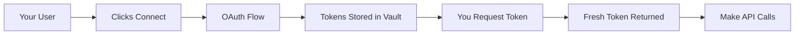

## How Alter Vault Works

Alter Vault is a secure token management service that handles OAuth credentials so you don't have to. We store, refresh, and inject tokens automatically, while you focus on building your product.

### The Flow



## Zero Token Exposure

Your application **never sees or stores OAuth tokens**. Here's what happens instead:

<Steps>
  <Step title="User Connects">
    User authorizes through Alter Connect UI (your frontend)
  </Step>

  <Step title="We Store Tokens">
    OAuth tokens are encrypted and stored in our secure vault
  </Step>

  <Step title="You Use Our SDK">
    Python SDK automatically injects tokens into API calls
  </Step>

  <Step title="Automatic Refresh">
    Tokens refresh before expiring - your calls never fail
  </Step>
</Steps>

## Security

### Encryption
- **AES-256-GCM** encryption for all stored tokens
- **TLS 1.3** for all data in transit
- **Hardware security modules** for key management

### Access Control
- **API key authentication** for your backend
- **Session tokens** for frontend (never expose API keys)
- **IP restrictions** available for additional security
- **Rate limiting** to prevent abuse

### Compliance
- **SOC 2 Type II** certified
- **HIPAA** compliant infrastructure
- **GDPR** compliant with data residency options
- **PCI DSS** Level 1 for payment integrations

## Attribution

Attribution is how you identify which OAuth connection to use. Instead of managing connection IDs, use your existing user identifiers:

```python
# Use YOUR user IDs, not ours
google = await vault.get_client(
    provider=Provider.GOOGLE,
    user={"user_id": "alice"}  # Your user ID
)
```

### Attribution Patterns

| Pattern | Example | Use Case |
|---------|---------|----------|
| **Single User** | `{"user_id": "alice"}` | Personal SaaS apps |
| **Multi-tenant** | `{"org_id": "acme", "user_id": "alice"}` | B2B SaaS |
| **Shared Team** | `{"team_id": "engineering"}` | Team resources |

## Custom Schemas

Add structured data to any OAuth connection:

```json
{
  "sync_preferences": {
    "calendar": {
      "enabled": true,
      "frequency": "hourly"
    },
    "email": {
      "enabled": false
    }
  }
}
```

Use cases:
- **Sync settings** - Which data to sync, how often
- **User preferences** - Per-connection configuration
- **Metadata** - Labels, tags, categories
- **Mapping** - Link to your internal records

## Performance

<CardGroup cols={3}>
  <Card title="Token Retrieval" icon="bolt">
    **Less than 10ms** for cached tokens
  </Card>

  <Card title="Availability" icon="server">
    **99.99%** uptime SLA
  </Card>

  <Card title="Scale" icon="chart-line">
    **Millions** of tokens/day
  </Card>
</CardGroup>

## Token Management

We handle the entire token lifecycle:

### What We Do Automatically

- ✅ **Store tokens securely** - Encrypted at rest
- ✅ **Refresh before expiry** - No failed API calls
- ✅ **Handle provider changes** - We adapt to API updates
- ✅ **Retry on failure** - Automatic error recovery
- ✅ **Audit all access** - Complete compliance trail

### What You Never Do

- ❌ Store tokens in your database
- ❌ Implement refresh logic
- ❌ Handle token expiration
- ❌ Manage encryption keys
- ❌ Build retry mechanisms

## Architecture Benefits

<AccordionGroup>
  <Accordion title="Reduced Security Risk">
    By never handling tokens directly, you eliminate the risk of token leaks, database breaches, or accidental exposure in logs.
  </Accordion>

  <Accordion title="Simplified Compliance">
    We handle the security certifications (SOC 2, HIPAA) so you can inherit our compliance without the audit burden.
  </Accordion>

  <Accordion title="Provider Agnostic">
    One integration with Alter Vault gives you access to 100+ OAuth providers without learning each API.
  </Accordion>

  <Accordion title="Maintenance Free">
    When Google changes their OAuth flow or Slack updates their API, we handle it. Your code doesn't change.
  </Accordion>
</AccordionGroup>

## Integration Example

Here's the complete flow in practice:

### 1. Frontend: User Connects

```javascript
// User clicks "Connect Google"
const { session_token } = await fetch('/api/session');
await alterConnect.open({
  token: session_token,
  onSuccess: (connection) => {
    // Connection complete!
  }
});
```

### 2. Backend: Use the Connection

```python
# Make API calls with auto-injected tokens
google = await vault.get_client(
    provider=Provider.GOOGLE,
    user={"user_id": "alice"}
)

calendar = await google.build("calendar", "v3")
events = calendar.events().list(calendarId="primary").execute()
```

That's it. No token handling, no refresh logic, no storage concerns.

## Getting Started

<CardGroup cols={2}>
  <Card title="Quick Start" icon="rocket" href="/quickstart">
    Connect your first integration in 5 minutes
  </Card>

  <Card title="Developer Portal" icon="browser" href="/reference/developer-portal">
    Configure your OAuth providers
  </Card>
</CardGroup>
