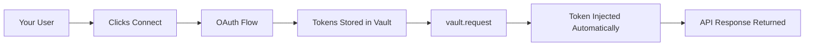
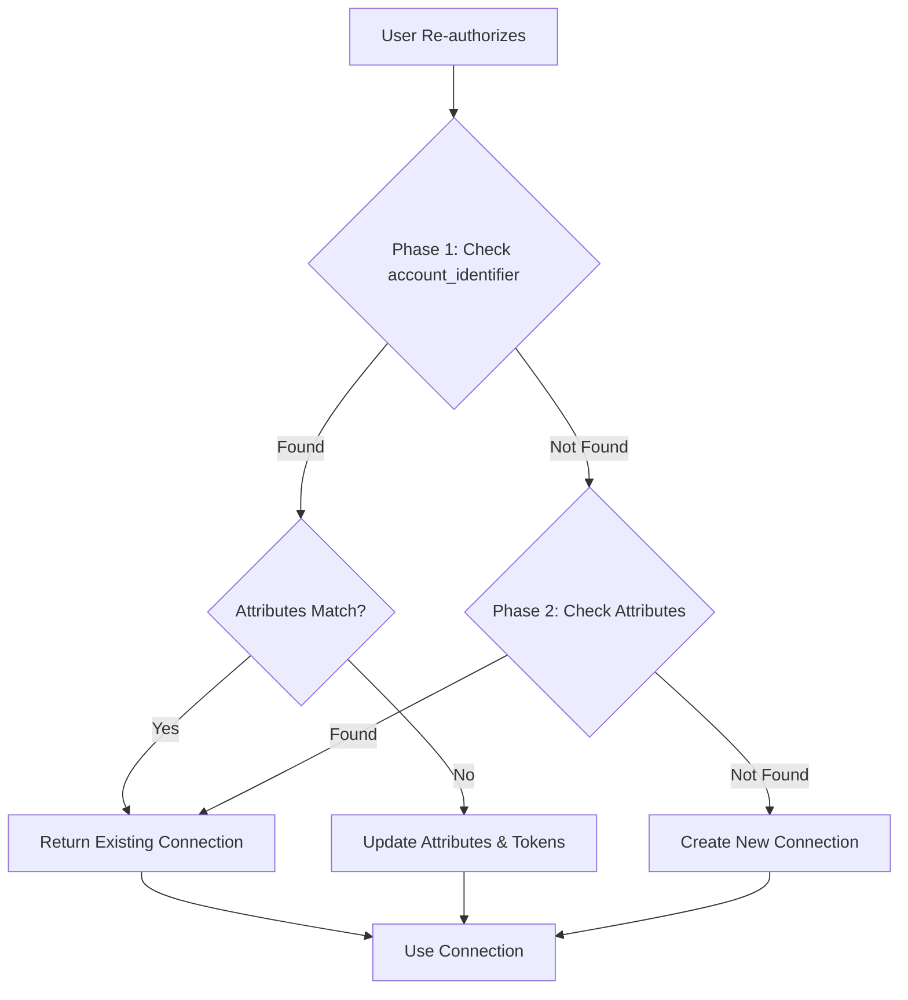

## How Alter Vault Works

Alter Vault is a secure token management service that handles OAuth credentials so you don't have to. We store, refresh, and inject tokens automatically, while you focus on building your product.

### The Flow



## Zero Token Exposure

Your application **never sees or stores OAuth tokens**. Here's what happens instead:

<Steps>
  <Step title="User Connects">
    User authorizes through Alter Connect UI (your frontend)
  </Step>

  <Step title="We Store Tokens">
    OAuth tokens are encrypted and stored in our secure vault
  </Step>

  <Step title="You Call vault.request()">
    Python SDK retrieves and injects tokens into API calls automatically
  </Step>

  <Step title="Automatic Refresh">
    Tokens refresh before expiring - your calls never fail
  </Step>
</Steps>

## Security

### Encryption
- **AES-256-GCM** encryption for all stored tokens
- **TLS 1.3** for all data in transit
- **Hardware security modules** for key management

### Access Control
- **API key authentication** for your backend
- **Session tokens** for frontend (never expose API keys)
- **Policy enforcement** via Cerbos (scope restrictions, time-based access, IP allowlist, required attributes)
- **Rate limiting** to prevent abuse
- **Fail-closed design** — if the policy service is unavailable, all token access is denied

### Compliance
- **SOC 2 Type II** certified
- **HIPAA** compliant infrastructure
- **GDPR** compliant with data residency options
- **PCI DSS** Level 1 for payment integrations

## Attribution

Attribution is how you identify which OAuth connection to use. Instead of managing connection IDs, use your existing user identifiers:

```python
# Use YOUR user IDs, not ours
response = await vault.request(
    Provider.GOOGLE,
    HttpMethod.GET,
    "https://www.googleapis.com/calendar/v3/calendars/primary/events",
    user={"user_id": "alice"},  # Your user ID
)
```

### Attribution Patterns

| Pattern | Example | Use Case |
|---------|---------|----------|
| **Single User** | `{"user_id": "alice"}` | Personal SaaS apps |
| **Multi-tenant** | `{"org_id": "acme", "user_id": "alice"}` | B2B SaaS |
| **Shared Team** | `{"team_id": "engineering"}` | Team resources |

## Connection Deduplication

Alter Vault automatically prevents duplicate OAuth connections for the same account. When a user re-authorizes (for example, after switching organizations), we **update** the existing connection instead of creating a duplicate. This works even when attribution attributes change.

### How It Works

We use a two-phase lookup strategy to find existing connections:



**Phase 1: Account Identifier Lookup**
- Search by the OAuth account identifier (email, sub, or ID from the provider)
- If found, check whether attributes match the current request
- If attributes differ, mark the connection for update

**Phase 2: Attributes Lookup**
- If Phase 1 doesn't find a connection, search by exact attribute match
- This handles cases where account_identifier isn't available

**Result**: The existing connection is updated with new tokens and attributes, OR a new connection is created if neither lookup finds a match.

### Example: User Changes Organization

When a user switches organizations and re-authorizes, Alter Vault updates the existing connection:

```python
# Scenario: Alice switches from Acme Corp to Globex Corp

# First authorization (Acme):
# Connection created:
{
    "id": "conn-abc123",
    "account_identifier": "alice@example.com",
    "attributes": {"user_id": "alice", "org_id": "acme"}
}

# Alice switches orgs and re-authorizes (Globex):
# Connection UPDATED (NOT duplicated):
{
    "id": "conn-abc123",  # SAME connection ID
    "account_identifier": "alice@example.com",  # Same account
    "attributes": {"user_id": "alice", "org_id": "globex"}  # NEW attributes
}

# Result: ONE connection with updated attributes and fresh tokens
```

### When Separate Connections Are Created

Separate connections exist when **different OAuth accounts** are used, even with the same attributes:

```python
# Connection 1: Alice's account
{
    "account_identifier": "alice@example.com",
    "attributes": {"org_id": "acme"}
}

# Connection 2: Bob's account
{
    "account_identifier": "bob@example.com",
    "attributes": {"org_id": "acme"}  # Same org, different user
}

# Result: TWO connections (different OAuth accounts)
```

### Choosing Your Attribution Strategy

Your attribution strategy determines how connections are deduplicated. Choose based on your use case:

| Strategy | Attributes | Use Case | Deduplication Behavior |
|----------|------------|----------|------------------------|
| **Org-level** | `{"org_id": "acme"}` | Shared team resources | One connection per org, any user can authorize |
| **User-level** | `{"user_id": "alice"}` | Personal accounts | One connection per user across all orgs |
| **Hybrid** | `{"org_id": "acme", "user_id": "alice"}` | User-specific org data | Separate connection per user per org |

**Organization-Level Attribution** (Recommended for B2B SaaS):

```python
# Any user in the org can use this connection
response = await vault.request(
    Provider.GOOGLE, HttpMethod.GET, url,
    user={"org_id": "acme"},
)
```

**User-Level Attribution** (Recommended for Personal Apps):

```python
# One connection per user, follows them across orgs
response = await vault.request(
    Provider.GOOGLE, HttpMethod.GET, url,
    user={"user_id": "alice"},
)
```

**Hybrid Attribution** (For complex multi-tenant scenarios):

```python
# Separate connection per user per org
response = await vault.request(
    Provider.GOOGLE, HttpMethod.GET, url,
    user={"org_id": "acme", "user_id": "alice"},
)
```

<Note>
If a user re-authorizes with the same OAuth account but different attributes, the connection is automatically updated. You don't need to handle this in your code.
</Note>

## Custom Schemas

Add structured data to any OAuth connection:

```json
{
  "sync_preferences": {
    "calendar": {
      "enabled": true,
      "frequency": "hourly"
    },
    "email": {
      "enabled": false
    }
  }
}
```

Use cases:
- **Sync settings** - Which data to sync, how often
- **User preferences** - Per-connection configuration
- **Metadata** - Labels, tags, categories
- **Mapping** - Link to your internal records

## Audit Logs

All activity is logged automatically, including token access, connection changes, API calls, and admin actions. View, filter, and export logs from the Developer Portal. AI agents and MCP servers are tracked with full context (actor name, run ID, thread ID).

See the [Audit Logs guide](/reference/audit-logs) for details on viewing and exporting logs.

## Performance

<CardGroup cols={3}>
  <Card title="Token Retrieval" icon="bolt">
    **Less than 10ms** for cached tokens
  </Card>

  <Card title="Availability" icon="server">
    **99.99%** uptime SLA
  </Card>

  <Card title="Scale" icon="chart-line">
    **Millions** of tokens/day
  </Card>
</CardGroup>

## Token Management

We handle the entire token lifecycle:

### What We Do Automatically

- ✅ **Store tokens securely** - Encrypted at rest
- ✅ **Refresh before expiry** - No failed API calls
- ✅ **Handle provider changes** - We adapt to API updates
- ✅ **Retry on failure** - Automatic error recovery
- ✅ **Audit all access** - Complete compliance trail

### What You Never Do

- ❌ Store tokens in your database
- ❌ Implement refresh logic
- ❌ Handle token expiration
- ❌ Manage encryption keys
- ❌ Build retry mechanisms

## Architecture Benefits

<AccordionGroup>
  <Accordion title="Reduced Security Risk">
    By never handling tokens directly, you eliminate the risk of token leaks, database breaches, or accidental exposure in logs.
  </Accordion>

  <Accordion title="Simplified Compliance">
    We handle the security certifications (SOC 2, HIPAA) so you can inherit our compliance without the audit burden.
  </Accordion>

  <Accordion title="Provider Agnostic">
    One integration with Alter Vault gives you access to 100+ OAuth providers without learning each API.
  </Accordion>

  <Accordion title="Maintenance Free">
    When Google changes their OAuth flow or Slack updates their API, we handle it. Your code doesn't change.
  </Accordion>
</AccordionGroup>

## Integration Example

Here's the complete flow in practice:

### 1. Frontend: User Connects

```javascript
// User clicks "Connect Google"
const { session_token } = await fetch('/api/session');
await alterConnect.open({
  token: session_token,
  onSuccess: (connection) => {
    // Connection complete!
  }
});
```

### 2. Backend: Use the Connection

```python
from alter_sdk import AlterVault, Provider, HttpMethod

vault = AlterVault(api_key="alter_key_...")

# Make API calls with auto-injected tokens
response = await vault.request(
    Provider.GOOGLE,
    HttpMethod.GET,
    "https://www.googleapis.com/calendar/v3/calendars/primary/events",
    user={"user_id": "alice"},
)
events = response.json()
```

That's it. No token handling, no refresh logic, no storage concerns.

## Getting Started

<CardGroup cols={2}>
  <Card title="Quick Start" icon="rocket" href="/quickstart">
    Connect your first integration in 5 minutes
  </Card>

  <Card title="Audit Logs" icon="clipboard-list" href="/reference/audit-logs">
    Compliance and observability
  </Card>

  <Card title="Developer Portal" icon="browser" href="/reference/developer-portal">
    Configure your OAuth providers
  </Card>

  <Card title="OpenClaw Plugin" icon="robot" href="/integrations/openclaw">
    AI agent OAuth integration
  </Card>
</CardGroup>
