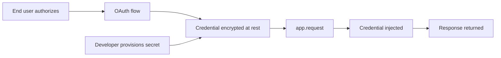

## How Alter Vault works

Alter Vault is the credential and authorization layer for apps and AI agents that call third-party APIs on behalf of users. Credentials are encrypted at rest, identity-aware policies are enforced on every retrieval, and every access is recorded in an audit trail.

### Two paths, one API

Both credential types are accessed through the same `app.request()` method:

- **OAuth grants** — for third-party services where end users authorize access.
- **Managed secrets** — for credentials the developer already holds (API keys, service tokens).


```mermaid
graph LR
    A1[End user authorizes] --> B1[OAuth flow]
    B1 --> C[Credential encrypted at rest]
    A2[Developer provisions secret] --> C
    C --> D[app.request]
    D --> E[Credential injected]
    E --> F[Response returned]
```

## Zero credential exposure

Application code never sees the credential. The flow:

<Steps>
  <Step title="Authorize or provision">
    **OAuth**: the end user authorizes through Alter Connect. **Managed secrets**: the developer stores the credential in the Developer Portal.
  </Step>

  <Step title="Encrypt at rest">
    Credentials are encrypted (AES-256-GCM) before persistence.
  </Step>

  <Step title="Call app.request()">
    The SDK retrieves and injects the credential into the outbound API call.
  </Step>

  <Step title="Refresh and rotate">
    OAuth tokens are refreshed before they expire. Managed-secret injection uses the right header format per provider.
  </Step>
</Steps>

## Security

- **Encryption at rest** — AES-256-GCM for all stored credentials.
- **TLS 1.3** for all data in transit.
- **API key authentication** for application backends; short-lived session tokens for browser-side flows.
- **Identity-aware policies** — time-based access, IP allowlist, URL/method restrictions, rules tied to the calling identity. See [Security Policies](/reference/policies).
- **Fail-closed** — when authorization cannot be evaluated, access is denied.

## Grant ID: the universal handle

Every credential in Alter Vault is addressed by a `grant_id` (UUID). Usage is identical via `app.request()` regardless of credential type. What differs is **where the `grant_id` comes from**:

| Credential Type | Where `grant_id` comes from | Who creates it |
|---|---|---|
| **OAuth** | `onSuccess` callback when the end user completes Alter Connect | The end user (by authorizing with Google, Slack, etc.) |
| **Managed Secret** | Developer Portal when storing the credential | The developer |

```python
# OAuth grant — per-user, returned by Alter Connect
response = await app.request(
    HttpMethod.GET,
    "https://www.googleapis.com/calendar/v3/calendars/primary/events",
    grant_id=oauth_grant_id,
)

# Managed secret — per-service, same grant_id for all callers
response = await app.request(
    HttpMethod.GET,
    "https://api.example.com/v1/resource",
    grant_id=managed_secret_grant_id,
)
```

<Note>
**OAuth grants are per-user**: each end user who authorizes gets their own `grant_id`. **Managed secrets are per-service**: one credential is provisioned and shared by all backend callers. Re-authorizing the same OAuth account updates the existing grant rather than creating a duplicate, so the `grant_id` is stable.
</Note>

## Custom schemas

Attach structured per-grant data — sync settings, user preferences, tags, internal IDs — to any OAuth connection.

```json
{
  "sync_preferences": {
    "calendar": { "enabled": true, "frequency": "hourly" },
    "email":    { "enabled": false }
  }
}
```

## Audit logs

Every credential access, every connection lifecycle event, every API call routed through `app.request()` is recorded with full actor context. View, filter, and export from the Developer Portal.

See the [Audit Logs guide](/reference/audit-logs).

## What Alter Vault handles vs. what application code doesn't

| Handled by Alter Vault | What application code no longer does |
|---|---|
| Encrypted credential storage | Store tokens or API keys |
| OAuth token refresh before expiry | Implement refresh logic |
| Per-provider header injection (Bearer, API key, Basic, multi-header) | Construct auth headers |
| Policy enforcement on every access | Build access-control checks |
| Audit trail for every access | Wire up compliance logging |

## Choosing a workload class

The SDK exposes two top-level classes:

- **`App`** — application backends acting on behalf of any end user the app stored a `grant_id` for, plus admin operations (provisioning agents, minting Connect sessions, managing grants).
- **`Agent`** — workload identities with their own access set. An agent can only reach credentials explicitly bound to it: either user-delegated OAuth grants (from a Connect flow that named the agent) or agent-owned managed secrets provisioned in the Developer Portal.

Both classes expose `request()`. Pick the one that matches the caller's identity.

```python
from alter_sdk import App, Agent, HttpMethod

# Application backend
app = App(api_key=APP_API_KEY)
response = await app.request(
    HttpMethod.GET,
    "https://www.googleapis.com/calendar/v3/calendars/primary/events",
    grant_id=grant_id,
)

# Agent workload
agent = Agent(api_key=AGENT_API_KEY)
response = await agent.request(
    HttpMethod.GET,
    "https://www.googleapis.com/calendar/v3/calendars/primary/events",
    provider="google",
)
```

See [Agents → Overview](/agents/overview) for the full agent model.

## Getting started

<CardGroup cols={3}>
  <Card title="First 5 Minutes" icon="rocket" href="/first-5-minutes">
    Hands-on walkthrough.
  </Card>

  <Card title="Audit Logs" icon="clipboard-list" href="/reference/audit-logs">
    Access history and exports.
  </Card>

  <Card title="Developer Portal" icon="browser" href="/reference/developer-portal">
    Configure providers and policies.
  </Card>
</CardGroup>
