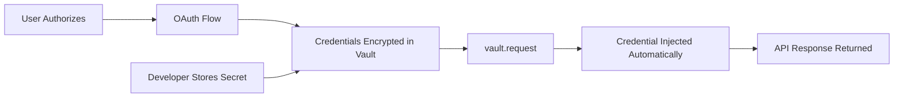
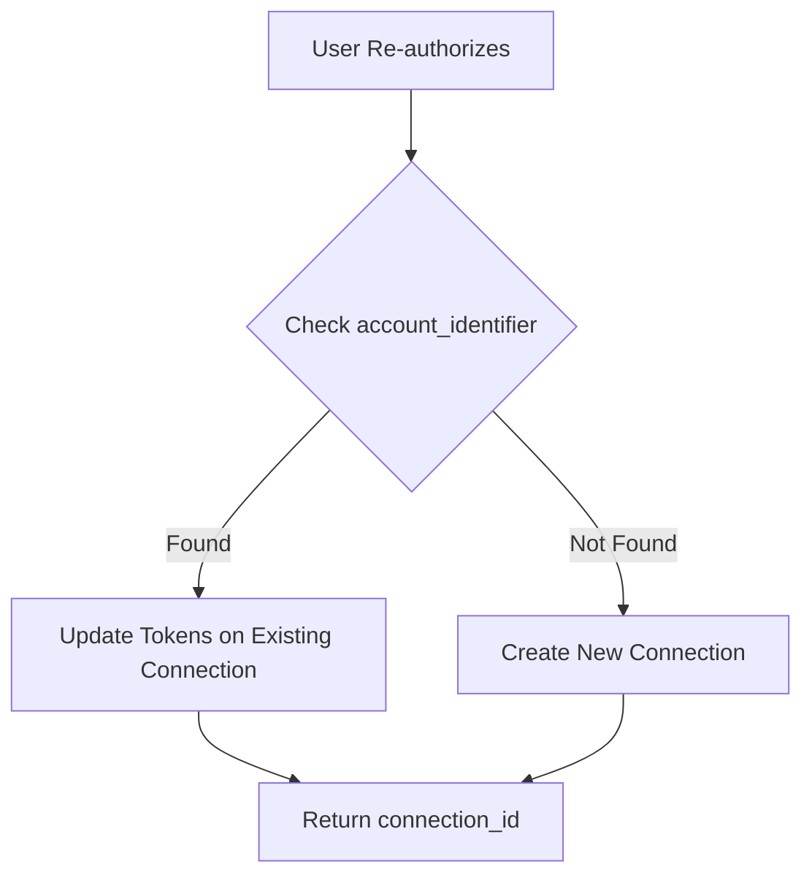

## How Alter Vault Works

Alter Vault is the credential and authorization layer for AI agents that serve multiple users across multiple services. It stores OAuth tokens and API credentials in an encrypted vault, enforces identity-aware policies on every access, and logs every action with full actor context.

### Two Paths, One API

Alter Vault supports two types of credentials, both accessed through the same `vault.request()` method:

- **OAuth Connections** — for third-party services where users authorize access (Google, Slack, GitHub)
- **Managed Secrets** — for internal APIs where credentials are already available (API keys, service tokens)


```mermaid
graph LR
    A1[User Authorizes] --> B1[OAuth Flow]
    B1 --> C[Credentials Encrypted in Vault]
    A2[Developer Stores Secret] --> C
    C --> D[vault.request]
    D --> E[Credential Injected Automatically]
    E --> F[API Response Returned]
```

## Zero Credential Exposure

Application code **never sees or stores credentials**. Here is what happens instead:

<Steps>
  <Step title="Connect or Store">
    **OAuth**: User authorizes through Alter Connect UI. **Managed Secrets**: Developer stores credentials via the Developer Portal.
  </Step>

  <Step title="Encrypt & Store">
    All credentials are encrypted (AES-256-GCM) and stored in a secure vault
  </Step>

  <Step title="Call vault.request()">
    The SDK retrieves and injects credentials into API calls automatically
  </Step>

  <Step title="Automatic Management">
    OAuth tokens refresh before expiring. Managed secrets are injected with the correct header format.
  </Step>
</Steps>

## Security

### Encryption
- **AES-256-GCM** encryption for all stored tokens
- **TLS 1.3** for all data in transit
- **Hardware security modules** for key management

### Access Control
- **API key authentication** for backend services
- **Session tokens** for frontend (never expose API keys)
- **Built-in policies** — time-based access, IP allowlist, connection TTL
- **Custom policies** — URL restrictions, HTTP method restrictions, rate limiting, and rules tied to user or actor identity. See [Security Policies](/reference/policies#custom-policies).
- **Fail-closed design** — if the policy service is unavailable, all token access is denied

### Compliance
- **SOC 2 Type II** certified
- **HIPAA** compliant infrastructure
- **GDPR** compliant with data residency options
- **PCI DSS** Level 1 for payment integrations

## Connection ID: The Universal Handle

Every credential in Alter Vault has a unique `connection_id` (UUID). Usage is identical via `vault.request()` regardless of credential type. The key difference is **where the `connection_id` comes from**:

| Credential Type | Where `connection_id` Comes From | Who Creates It |
|---|---|---|
| **OAuth** | `onSuccess` callback when end user completes OAuth via Alter Connect | **End user** (by logging into Google, Slack, etc.) |
| **Managed Secret** | Developer Portal when storing a credential | **Developer** (via portal UI) |

```python
# OAuth connection — connection_id from end user completing Alter Connect
# (stored in your DB, mapped to your user)
oauth_conn_id = db.get_connection(user_id="alice", provider="google")
response = await vault.request(
    oauth_conn_id,
    HttpMethod.GET,
    "https://www.googleapis.com/calendar/v3/calendars/primary/events",
)

# Managed secret — connection_id from Developer Portal
# (stored in your config/env vars, same for all users)
response = await vault.request(
    os.environ["LOYALTY_API_CONNECTION_ID"],
    HttpMethod.GET,
    "https://api.internal.com/v1/loyalty/points",
)
```

<Note>
**OAuth connections are per-user** — each end user who authorizes gets their own `connection_id`. **Managed secrets are per-service** — one credential is stored and all backend code shares the same `connection_id`.
</Note>

### Connection Deduplication

Alter Vault automatically prevents duplicate OAuth connections for the same account. When a user re-authorizes, the existing connection is **updated** instead of creating a duplicate.


```mermaid
graph TD
    A[User Re-authorizes] --> B{Check account_identifier}
    B -->|Found| C[Update Tokens on Existing Connection]
    B -->|Not Found| D[Create New Connection]

    C --> E[Return connection_id]
    D --> E
```

- Search by the OAuth account identifier (email, sub, or ID from the provider)
- If found, update the existing connection with fresh tokens
- If not found, create a new connection and return the new `connection_id`

<Note>
If a user re-authorizes with the same OAuth account, the existing connection is updated. The `connection_id` remains the same.
</Note>

## Custom Schemas

Add structured data to any OAuth connection:

```json
{
  "sync_preferences": {
    "calendar": {
      "enabled": true,
      "frequency": "hourly"
    },
    "email": {
      "enabled": false
    }
  }
}
```

Use cases:
- **Sync settings** - Which data to sync, how often
- **User preferences** - Per-connection configuration
- **Metadata** - Labels, tags, categories
- **Mapping** - Link to internal records

## Audit Logs

All activity is logged automatically, including token access, connection changes, API calls, and admin actions. View, filter, and export logs from the Developer Portal. AI agents and MCP servers are tracked with full context (actor name, run ID, thread ID).

See the [Audit Logs guide](/reference/audit-logs) for details on viewing and exporting logs.

## Performance

<CardGroup cols={3}>
  <Card title="Token Retrieval" icon="bolt">
    **Less than 10ms** for cached tokens
  </Card>

  <Card title="Availability" icon="server">
    **99.99%** uptime SLA
  </Card>

  <Card title="Scale" icon="chart-line">
    **Millions** of tokens/day
  </Card>
</CardGroup>

## Credential Management

Alter Vault handles the entire credential lifecycle:

### Automatic

- ✅ **Store credentials securely** — Encrypted at rest (AES-256-GCM)
- ✅ **Refresh OAuth tokens before expiry** — No failed API calls
- ✅ **Inject the right header** — Bearer, API Key, Basic Auth — automatic
- ✅ **Enforce policies** — Time-based and IP restrictions on every access
- ✅ **Retry on failure** — Automatic error recovery
- ✅ **Audit all access** — Complete compliance trail for both OAuth and managed secrets

### Eliminated

- ❌ Store tokens or API keys in the application database
- ❌ Implement refresh logic
- ❌ Construct auth headers manually
- ❌ Manage encryption keys
- ❌ Build retry mechanisms

## Architecture Benefits

<AccordionGroup>
  <Accordion title="Reduced Security Risk">
    Tokens are never handled directly by application code, eliminating the risk of token leaks, database breaches, or accidental exposure in logs.
  </Accordion>

  <Accordion title="Simplified Compliance">
    Alter Vault carries SOC 2 and HIPAA certifications, reducing the compliance burden for applications built on top of it.
  </Accordion>

  <Accordion title="Provider Agnostic">
    One integration with Alter Vault provides access to 100+ OAuth providers without learning each API.
  </Accordion>

  <Accordion title="Maintenance Free">
    When Google changes their OAuth flow or Slack updates their API, Alter Vault handles it. Application code does not change.
  </Accordion>
</AccordionGroup>

## Integration Example

The complete flow in practice:

### 1. Frontend: User Connects (OAuth)

```javascript
// User clicks "Connect Google" — your backend creates a session (no user_id needed)
const { session_token } = await fetch('/api/session').then(r => r.json());
await alterConnect.open({
  token: session_token,
  onSuccess: (connections) => {
    // User completed OAuth! Each connection has a connection_id.
    // Store these in your database, mapped to your user.
    for (const conn of connections) {
      saveToDb(currentUser.id, conn.connection_id, conn.provider);
    }
  }
});
```

### 2. Backend: Use the Connection

```python
from alter_sdk import AlterVault, ActorType, HttpMethod

vault = AlterVault(
    api_key="alter_key_...",
    actor_type=ActorType.BACKEND_SERVICE,
    actor_identifier="my-service",
)

# OAuth: connection_id from your DB (stored when user completed Alter Connect)
connection_id = db.get_connection(user_id="alice", provider="google")
response = await vault.request(
    connection_id,
    HttpMethod.GET,
    "https://www.googleapis.com/calendar/v3/calendars/primary/events",
)
events = response.json()

# Managed secret: connection_id from Developer Portal (stored in your config)
response = await vault.request(
    os.environ["LOYALTY_API_CONNECTION_ID"],
    HttpMethod.GET,
    "https://api.internal.com/v1/loyalty/points",
)
```

That's it. No token handling, no refresh logic, no storage concerns.

## Getting Started

<CardGroup cols={2}>
  <Card title="Quick Start" icon="rocket" href="/quickstart">
    Connect a first integration in 5 minutes
  </Card>

  <Card title="Audit Logs" icon="clipboard-list" href="/reference/audit-logs">
    Compliance and observability
  </Card>

  <Card title="Developer Portal" icon="browser" href="/reference/developer-portal">
    Configure OAuth providers
  </Card>

</CardGroup>
