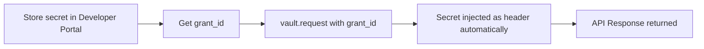

## What Are Managed Secrets?

Managed Secrets store API keys, service tokens, and other credentials for internal APIs in Alter Vault. They get the same security treatment as OAuth tokens: encrypted storage, zero exposure to application code, policy enforcement, and full audit logging.

<Note>
  **OAuth vs Managed Secrets**: Use OAuth for third-party services where **end users** authorize access (Google, Slack, GitHub) — the `grant_id` comes from the user completing the OAuth flow. Use Managed Secrets for internal APIs where credentials are already available — the `grant_id` comes from the Developer Portal when storing the secret. Once a `grant_id` is obtained, the SDK usage is identical.
</Note>

## How They Work



<Steps>
  <Step title="Store a Secret">
    Add the API key, service token, or credentials via the Developer Portal's **Managed Secrets** tab
  </Step>

  <Step title="Get the Grant ID">
    Each stored secret gets a `grant_id` (UUID) — save this in application code or config
  </Step>

  <Step title="Call vault.request()">
    Use the same `vault.request()` method used for OAuth — just pass the secret's `grant_id`
  </Step>

  <Step title="Secret Injected Automatically">
    Alter Vault injects the credential as the appropriate header (`Authorization: Bearer`, `X-API-Key`, etc.)
  </Step>
</Steps>

## Storing Managed Secrets

In the Developer Portal:

1. Open the app and go to **Managed Secrets**
2. Click **Add Provider** — choose a pre-configured template (40+ services) or select **Custom** for any API
3. Choose the credential type:
   - **Bearer Token** — injected as `Authorization: Bearer <token>`
   - **API Key** — injected as a custom header (e.g., `X-API-Key: <key>`)
   - **Basic Auth** — injected as `Authorization: Basic <base64>`
   - **AWS SigV4** — AWS Signature Version 4 (computed automatically)
4. For custom secrets, you can also configure the header name, injection format, and additional injection rules for multi-header or query parameter authentication
5. Click **Store Secret** on the provider to save the credential value. Give each grant a name and description for easy identification.
6. Copy the `grant_id` returned

Manage connections from the provider detail page: edit names, clone connections (with optional TTL), regenerate connection IDs, or revoke access.

<Warning>
  Secret values are write-only. Once stored, the raw value cannot be retrieved — it can only be used via `vault.request()`. This is by design for security.
</Warning>

## Using Managed Secrets via SDK

Use `vault.request()` exactly the same way as OAuth grants. The SDK auto-detects the grant type and injects the right header.

<CodeGroup>

```python Python
from alter_sdk import AlterVault, HttpMethod

async with AlterVault(
    api_key="alter_key_...",
    caller="my-agent",
) as vault:
    # Call your internal API — secret is injected automatically
    response = await vault.request(
        HttpMethod.GET,
        "https://api.internal.com/v1/loyalty/points",
        grant_id="MANAGED_SECRET_GRANT_ID",  # from Developer Portal
        query_params={"user_id": "alice"},
        reason="Checking loyalty points for rewards calculation",
    )
    points = response.json()
```

```typescript TypeScript
import { AlterVault, HttpMethod } from "@alter-ai/alter-sdk";

const vault = new AlterVault({
  apiKey: "alter_key_...",
  caller: "my-agent",
});

// Call your internal API — secret is injected automatically
const response = await vault.request(
  HttpMethod.GET,
  "https://api.internal.com/v1/loyalty/points",
  {
    grantId: "MANAGED_SECRET_GRANT_ID",  // from Developer Portal
    queryParams: { user_id: "alice" },
    reason: "Checking loyalty points for rewards calculation",
  }
);
const points = await response.json();

await vault.close();
```

</CodeGroup>

## Dynamic Header Injection

Alter Vault automatically injects the credential in the correct header format based on the configured credential type:

| Credential Type | Header Injected |
|----------------|----------------|
| Bearer Token | `Authorization: Bearer <token>` |
| API Key | Custom header (e.g., `X-API-Key: <key>`) |
| Basic Auth | `Authorization: Basic <base64(user:pass)>` |
| AWS SigV4 | AWS Signature Version 4 (computed automatically) |

Auth headers are never constructed manually — `vault.request()` handles it.

## Policy Enforcement

Managed secrets follow the same policy enforcement as OAuth grants. Available options:

- **Time-based access** — restrict secret usage to business hours or weekdays
- **IP allowlist** — only allow access from specific IPs or CIDR ranges

Policies are configured per provider in the Developer Portal under **Policies**. If any rule fails, access is denied.

### Handling Policy Violations

When a policy denies access, the SDK raises specific exceptions depending on the denial type. Handle all three policy-related errors:

<CodeGroup>

```python Python
from alter_sdk import AlterVault, HttpMethod
from alter_sdk.exceptions import (
    GrantExpiredError,
    PolicyViolationError,
    ReAuthRequiredError,
)

async with AlterVault(
    api_key="alter_key_...",
    caller="my-agent",
) as vault:
    try:
        response = await vault.request(
            HttpMethod.GET,
            "https://api.internal.com/v1/data",
            grant_id=grant_id,
        )
    except GrantExpiredError:
        # TTL expired — connection was cloned with a time limit
        print("Connection expired. Please create a new connection.")
    except PolicyViolationError as e:
        # Time-based or IP allowlist denial
        print(f"Access denied by policy: {e.message} (rule: {e.policy_error})")
    except ReAuthRequiredError:
        # Connection revoked or deleted — re-store the credential
        print("Connection no longer valid. Please re-store the secret in the Developer Portal.")
```

```typescript TypeScript
import {
  AlterVault, HttpMethod,
  GrantExpiredError, PolicyViolationError, ReAuthRequiredError,
} from "@alter-ai/alter-sdk";

const vault = new AlterVault({
  apiKey: "alter_key_...",
  caller: "my-agent",
});

try {
  const response = await vault.request(
    HttpMethod.GET,
    "https://api.internal.com/v1/data",
    { grantId },
  );
} catch (error) {
  if (error instanceof GrantExpiredError) {
    // TTL expired — connection was cloned with a time limit
    console.log("Connection expired. Please create a new connection.");
  } else if (error instanceof PolicyViolationError) {
    // Time-based or IP allowlist denial
    console.log(`Access denied by policy: ${error.message} (rule: ${error.policyError})`);
  } else if (error instanceof ReAuthRequiredError) {
    // Connection revoked or deleted — re-store the credential
    console.log("Connection no longer valid. Please re-store the secret in the Developer Portal.");
  } else {
    throw error;
  }
} finally {
  await vault.close();
}
```

</CodeGroup>

| Error | When It's Raised | Action |
|-------|-----------------|--------|
| `GrantExpiredError` | Cloned grant's TTL has expired | Create a new grant or clone |
| `PolicyViolationError` | Time-based restriction or IP allowlist denial | Use `policy_error` / `policyError` to programmatically identify the violated rule; adjust timing or IP |
| `ReAuthRequiredError` | Connection was revoked or deleted | Re-store the credential in the Developer Portal |

## Custom Policies

The built-in policy types (time-based, IP allowlist, connection TTL) cover common access control patterns. For more advanced requirements, Alter Vault supports custom policies tailored to specific use cases:

- **URL restrictions** — limit which API endpoints a credential can be used against
- **HTTP method restrictions** — allow read-only access (GET only) for certain actors
- **Rate limiting** — cap how many requests a credential can serve per time window
- **Custom rules** — any logic tied to end-user identity, actor identity, or request context

Custom policies are enforced at the same layer as built-in policies, with the same fail-closed guarantees and audit logging.

<Card title="Set up custom policies" icon="envelope" href="mailto:founders@alterauth.com">
  Contact the team to configure custom policies for a specific use case.
</Card>

See the [Security Policies guide](/reference/policies#custom-policies) for more detail.

## Audit Logging

Every use of a managed secret is logged automatically, just like OAuth token access:

- **Who** accessed the secret (actor identity, AI agent name)
- **What** API was called (HTTP method, URL)
- **When** it happened (timestamp)
- **Why** (the `reason` parameter)
- **Outcome** (success, policy denial, error)

View managed secret access logs in the Developer Portal under **Audit Logs**. Filter by provider to see all activity for a specific secret.

## Use Cases

<AccordionGroup>
  <Accordion title="Airline Chatbot — Loyalty API" icon="plane">
    Store the airline loyalty program API key as a managed secret. The AI chatbot agent uses `vault.request()` to check points balances, book reward flights, and manage member accounts — without the API key ever appearing in agent code.
  </Accordion>

  <Accordion title="Healthcare App — Patient Records API" icon="heart-pulse">
    Store the EHR system's service token as a managed secret. Policy enforcement ensures the token is only used during business hours from approved IP addresses. Every access is logged for HIPAA compliance.
  </Accordion>

  <Accordion title="SaaS Platform — Billing API" icon="credit-card">
    Store the payment processor's API key. The backend service calls billing endpoints through `vault.request()`, with full audit logging of every charge and refund operation.
  </Accordion>

  <Accordion title="Internal Microservices" icon="server">
    Store service-to-service authentication tokens. Centralize credential management instead of scattering API keys across environment variables in multiple services.
  </Accordion>
</AccordionGroup>

## Key Differences from OAuth

| | OAuth Connections | Managed Secrets |
|---|---|---|
| **Who provides credentials** | **End user** authorizes via OAuth flow | **Developer** stores via portal |
| **Where `grant_id` comes from** | `onSuccess` callback after user completes Alter Connect | Developer Portal when storing a secret |
| **`grant_id` is per...** | Per user (each user who authorizes gets their own) | Per service (one credential shared across the backend) |
| **Setup** | Alter Connect UI (frontend) or `vault.connect()` (headless) | Developer Portal → Managed Secrets → Store Secret |
| **Token refresh** | Automatic (OAuth refresh flow) | Manual (re-store when rotated) |
| **User consent** | Required (user logs in) | Not applicable (developer stores directly) |
| **Visible in Wallet** | Yes (users see their connections) | No (backend-only) |
| **`vault.request()`** | Same method | Same method |
| **Policy enforcement** | Same | Same |
| **Audit logging** | Same | Same |
| **Encryption** | Same (AES-256-GCM) | Same (AES-256-GCM) |

## Next Steps

<CardGroup cols={2}>
  <Card title="Developer Portal" icon="browser" href="/reference/developer-portal#managed-secrets">
    Set up managed secret providers
  </Card>
  <Card title="Quickstart" icon="rocket" href="/quickstart#alternative-using-managed-secrets">
    Step-by-step managed secrets integration
  </Card>
  <Card title="Architecture" icon="building" href="/reference/architecture">
    Security model and encryption details
  </Card>
  <Card title="Audit Logs" icon="clipboard-list" href="/reference/audit-logs">
    Monitor managed secret access
  </Card>
</CardGroup>
