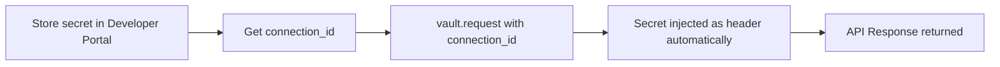

## What Are Managed Secrets?

Managed Secrets let you store API keys, service tokens, and other credentials for your own APIs in Alter Vault. They get the same security treatment as OAuth tokens: encrypted storage, zero exposure to your code, policy enforcement, and full audit logging.

<Note>
  **OAuth vs Managed Secrets**: Use OAuth for third-party services where **end users** authorize access (Google, Slack, GitHub) — the `connection_id` comes from the user completing the OAuth flow. Use Managed Secrets for your own APIs where **you** already have the credentials — the `connection_id` comes from the Developer Portal when you store the secret. Once you have a `connection_id`, the SDK usage is identical.
</Note>

## How They Work



<Steps>
  <Step title="Store Your Secret">
    Add your API key, service token, or credentials via the Developer Portal's **Managed Secrets** tab
  </Step>

  <Step title="Get the Connection ID">
    Each stored secret gets a `connection_id` (UUID) — save this in your code or config
  </Step>

  <Step title="Call vault.request()">
    Use the same `vault.request()` method you use for OAuth — just pass the secret's `connection_id`
  </Step>

  <Step title="Secret Injected Automatically">
    Alter Vault injects the credential as the appropriate header (`Authorization: Bearer`, `X-API-Key`, etc.)
  </Step>
</Steps>

## Storing Managed Secrets

In the Developer Portal:

1. Open your app and go to **Managed Secrets**
2. Click **Add Provider** — choose a pre-configured template (40+ services) or select **Custom** for any API
3. Choose the credential type:
   - **Bearer Token** — injected as `Authorization: Bearer <token>`
   - **API Key** — injected as a custom header (e.g., `X-API-Key: <key>`)
   - **Basic Auth** — injected as `Authorization: Basic <base64>`
   - **AWS SigV4** — AWS Signature Version 4 (computed automatically)
4. For custom secrets, you can also configure the header name, injection format, and additional injection rules for multi-header or query parameter authentication
5. Click **Store Secret** on the provider to save the credential value. Give each connection a name and description for easy identification.
6. Copy the `connection_id` returned

You can manage connections from the provider detail page: edit names, clone connections (with optional TTL), regenerate connection IDs, or revoke access.

<Warning>
  Secret values are write-only. Once stored, you cannot retrieve the raw value — only use it via `vault.request()`. This is by design for security.
</Warning>

## Using Managed Secrets via SDK

Use `vault.request()` exactly the same way as OAuth connections. The SDK auto-detects the connection type and injects the right header.

<CodeGroup>

```python Python
from alter_sdk import AlterVault, ActorType, HttpMethod

async with AlterVault(
    api_key="alter_key_...",
    actor_type=ActorType.AI_AGENT,
    actor_identifier="my-agent",
) as vault:
    # Call your internal API — secret is injected automatically
    response = await vault.request(
        "MANAGED_SECRET_CONNECTION_ID",  # from Developer Portal
        HttpMethod.GET,
        "https://api.internal.com/v1/loyalty/points",
        query_params={"user_id": "alice"},
        reason="Checking loyalty points for rewards calculation",
    )
    points = response.json()
```

```typescript TypeScript
import { AlterVault, ActorType, HttpMethod } from "@alter-ai/alter-sdk";

const vault = new AlterVault({
  apiKey: "alter_key_...",
  actorType: ActorType.AI_AGENT,
  actorIdentifier: "my-agent",
});

// Call your internal API — secret is injected automatically
const response = await vault.request(
  "MANAGED_SECRET_CONNECTION_ID",  // from Developer Portal
  HttpMethod.GET,
  "https://api.internal.com/v1/loyalty/points",
  {
    queryParams: { user_id: "alice" },
    reason: "Checking loyalty points for rewards calculation",
  }
);
const points = await response.json();

await vault.close();
```

</CodeGroup>

## Dynamic Header Injection

Alter Vault automatically injects the credential in the correct header format based on the credential type you configured:

| Credential Type | Header Injected |
|----------------|----------------|
| Bearer Token | `Authorization: Bearer <token>` |
| API Key | Custom header (e.g., `X-API-Key: <key>`) |
| Basic Auth | `Authorization: Basic <base64(user:pass)>` |
| AWS SigV4 | AWS Signature Version 4 (computed automatically) |

You never construct auth headers manually — `vault.request()` handles it.

## Policy Enforcement

Managed secrets follow the same policy enforcement as OAuth connections. You can configure:

- **Time-based access** — restrict secret usage to business hours or weekdays
- **IP allowlist** — only allow access from specific IPs or CIDR ranges

Policies are configured per provider in the Developer Portal under **Policies**. If any rule fails, access is denied.

## Audit Logging

Every use of a managed secret is logged automatically, just like OAuth token access:

- **Who** accessed the secret (actor identity, AI agent name)
- **What** API was called (HTTP method, URL)
- **When** it happened (timestamp)
- **Why** (the `reason` parameter)
- **Outcome** (success, policy denial, error)

View managed secret access logs in the Developer Portal under **Audit Logs**. You can filter by provider to see all activity for a specific secret.

## Use Cases

<AccordionGroup>
  <Accordion title="Airline Chatbot — Loyalty API" icon="plane">
    Store your airline's loyalty program API key as a managed secret. Your AI chatbot agent uses `vault.request()` to check points balances, book reward flights, and manage member accounts — without the API key ever appearing in your agent code.
  </Accordion>

  <Accordion title="Healthcare App — Patient Records API" icon="heart-pulse">
    Store your EHR system's service token as a managed secret. Policy enforcement ensures the token is only used during business hours from approved IP addresses. Every access is logged for HIPAA compliance.
  </Accordion>

  <Accordion title="SaaS Platform — Billing API" icon="credit-card">
    Store your payment processor's API key. Your backend service calls billing endpoints through `vault.request()`, with full audit logging of every charge and refund operation.
  </Accordion>

  <Accordion title="Internal Microservices" icon="server">
    Store service-to-service authentication tokens. Centralize credential management instead of scattering API keys across environment variables in multiple services.
  </Accordion>
</AccordionGroup>

## Key Differences from OAuth

| | OAuth Connections | Managed Secrets |
|---|---|---|
| **Who provides credentials** | **End user** authorizes via OAuth flow | **Developer** stores via portal |
| **Where `connection_id` comes from** | `onSuccess` callback after user completes Alter Connect | Developer Portal when you store a secret |
| **`connection_id` is per...** | Per user (each user who authorizes gets their own) | Per service (one credential shared across your backend) |
| **Setup** | Alter Connect UI (frontend) or `vault.connect()` (headless) | Developer Portal → Managed Secrets → Store Secret |
| **Token refresh** | Automatic (OAuth refresh flow) | Manual (re-store when rotated) |
| **User consent** | Required (user logs in) | Not applicable (developer stores directly) |
| **Visible in Wallet** | Yes (users see their connections) | No (backend-only) |
| **`vault.request()`** | Same method | Same method |
| **Policy enforcement** | Same | Same |
| **Audit logging** | Same | Same |
| **Encryption** | Same (AES-256-GCM) | Same (AES-256-GCM) |

## Next Steps

<CardGroup cols={2}>
  <Card title="Developer Portal" icon="browser" href="/reference/developer-portal#managed-secrets">
    Set up managed secret providers
  </Card>
  <Card title="Quickstart" icon="rocket" href="/quickstart#alternative-using-managed-secrets">
    Step-by-step managed secrets integration
  </Card>
  <Card title="Architecture" icon="building" href="/reference/architecture">
    Security model and encryption details
  </Card>
  <Card title="Audit Logs" icon="clipboard-list" href="/reference/audit-logs">
    Monitor managed secret access
  </Card>
</CardGroup>
