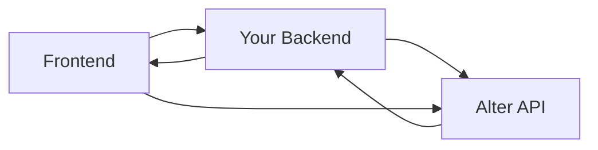

Alter Connect is a lightweight JavaScript SDK for embedding OAuth integrations into your application. Inspired by Plaid Link, the SDK provides a seamless, popup-based experience for end users to connect their third-party accounts.

## What It Provides

- **Frontend OAuth UI** - Modal/popup provider selection and authorization flow
- **Session-based security** - Uses temporary tokens from your backend (Plaid-style)
- **Zero token exposure** - OAuth tokens never reach the frontend
- **TypeScript support** - Full type definitions included
- **Framework agnostic** - Works with React, Vue, Angular, or vanilla JavaScript

## Installation Methods

<Tabs>
  <Tab title="npm">
    ```bash
    npm install @alter-ai/connect
    ```
  </Tab>

  <Tab title="yarn">
    ```bash
    yarn add @alter-ai/connect
    ```
  </Tab>

  <Tab title="pnpm">
    ```bash
    pnpm add @alter-ai/connect
    ```
  </Tab>

  <Tab title="CDN">
    ```html
    <script src="https://cdn.jsdelivr.net/npm/@alter-ai/connect@latest/dist/alter-connect.umd.js"></script>
    ```
  </Tab>
</Tabs>

## Package Details

<CardGroup cols={2}>
  <Card title="Bundle Size" icon="weight-hanging">
    ~45KB minified, ~15KB gzipped
  </Card>

  <Card title="Zero Dependencies" icon="cube">
    No runtime dependencies - pure vanilla JavaScript
  </Card>

  <Card title="TypeScript Support" icon="code">
    Full type definitions included
  </Card>

  <Card title="Framework Agnostic" icon="layer-group">
    Works with React, Vue, Angular, or no framework
  </Card>
</CardGroup>

## Module Formats

The SDK ships with multiple module formats:

| Format | File | Usage |
|--------|------|-------|
| **UMD** | `alter-connect.umd.js` | Browser global, CDN |
| **ESM** | `alter-connect.esm.js` | Modern bundlers |
| **CJS** | `alter-connect.cjs.js` | Node.js, older bundlers |

## TypeScript Support

Full TypeScript definitions are included. No need to install `@types` packages.

```typescript
import AlterConnect, {
  AlterConnectConfig,
  Connection,
  AlterError
} from '@alter-ai/connect';

const alterConnect: AlterConnect = AlterConnect.create({
  debug: true
});
```

## Browser Support

<AccordionGroup>
  <Accordion title="Desktop Browsers" icon="desktop">
    - Chrome/Edge 90+
    - Firefox 88+
    - Safari 14+
  </Accordion>

  <Accordion title="Mobile Browsers" icon="mobile">
    - iOS Safari 14+
    - Chrome Mobile (latest)
    - Firefox Mobile (latest)
  </Accordion>
</AccordionGroup>

## Security Architecture

<Warning>
  **Important**: The SDK follows a Plaid-style security model. Your API keys never touch the frontend. Session tokens are created by your backend.
</Warning>



Key security features:
- **API keys never in frontend** - Only your backend has the API key
- **Session tokens are short-lived** - Expire after 10 minutes
- **Session tokens are single-use** - Can only create one connection
- **Session tokens are scoped** - Locked to specific user & providers

## Verify Installation

### Module Import

```javascript
// ESM
import AlterConnect from '@alter-ai/connect';
console.log(AlterConnect.version); // "0.1.0"

// CommonJS
const AlterConnect = require('@alter-ai/connect');
console.log(AlterConnect.version); // "0.1.0"
```

### CDN Global

```html
<script src="https://cdn.jsdelivr.net/npm/@alter-ai/connect@latest/dist/alter-connect.umd.js"></script>
<script>
  console.log(window.AlterConnect.version); // "0.1.0"
</script>
```

## Development vs Production

<Tabs>
  <Tab title="Development">
    ```javascript
    const alterConnect = AlterConnect.create({
      debug: true  // Enable console logging
    });
    ```

    Features:
    - Console logging enabled
    - Detailed error messages
    - Event tracking logs
  </Tab>

  <Tab title="Production">
    ```javascript
    const alterConnect = AlterConnect.create({
      debug: false  // Default
    });
    ```

    Features:
    - No console logging
    - Minified error messages
    - Optimized performance
  </Tab>
</Tabs>

## Next Steps

<CardGroup cols={2}>
  <Card title="Quickstart" icon="rocket" href="/sdks/javascript/quickstart">
    Your first OAuth connection in 5 minutes
  </Card>

  <Card title="Reference" icon="code" href="/sdks/javascript/reference">
    Complete API reference
  </Card>
</CardGroup>
